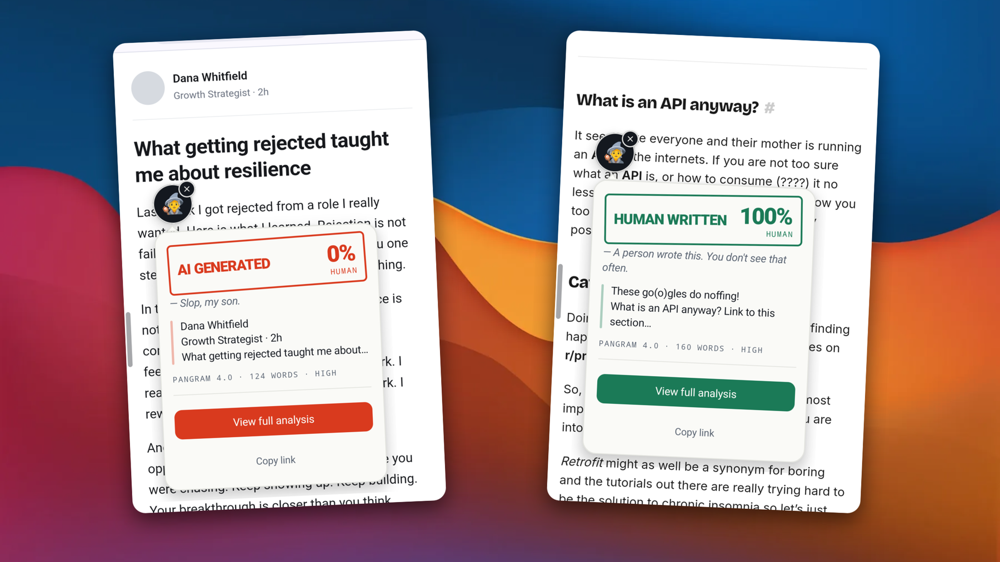
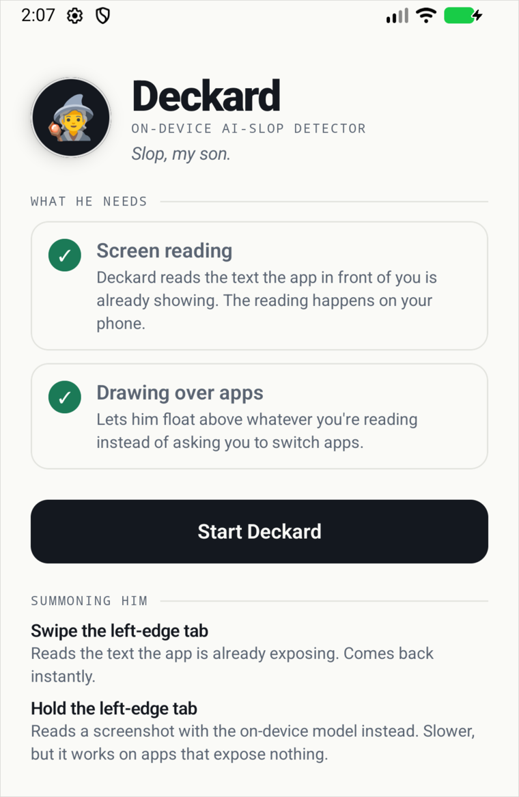
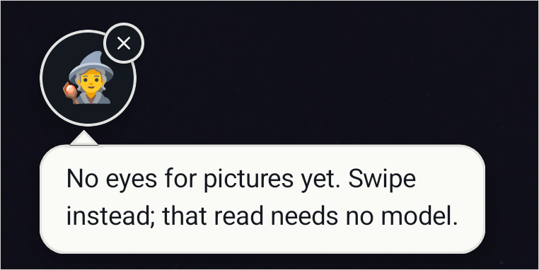
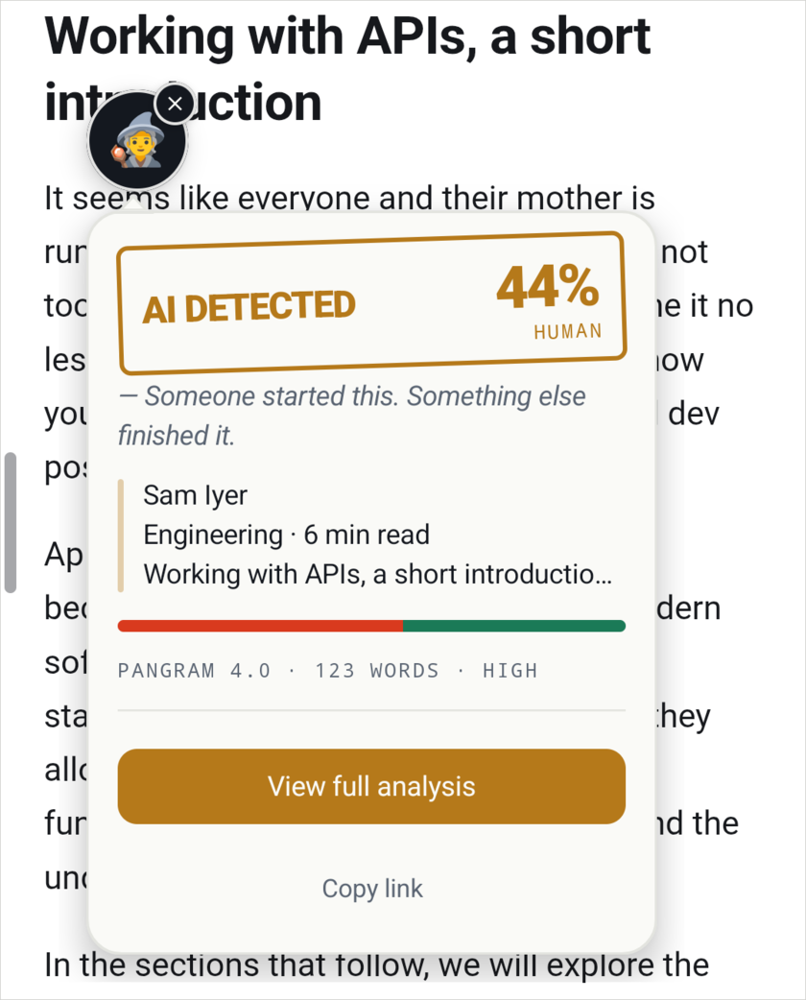

# deckard

<!-- shot: two real swipe reads composited on the wave gradient — a machine-written post on the left, the 2019 retrofit-review post on the right, both judged by pangram-4 -->


An Android app that judges whether what is on your screen was written by a machine. A wizard sits
in an overlay above every other app; summon him and he reads the current screen and stamps a
verdict on it.

Android 11+. Not on Play, so you build it yourself.

## What you need

A Pangram API key. The judging is Pangram's — put the key in `local.properties` as
`AI_DETECTOR_API_KEY`, or export it as an environment variable of the same name. Without one
Deckard reads the screen fine and then falls over at the network.

Two permissions, both granted from the setup screen: draw over other apps, and the accessibility
service that does the reading. He will not start without them.

<!-- shot: MainActivity with both permissions granted, emulator on API 37, cropped below the summoning section -->


A vision model, for the screenshot path. On a phone that has Gemini Nano he borrows the phone's own,
through Google's AICore, and there is nothing to install. On any other phone, optionally a
`.litertlm` Gemma build, 2.4–3.5GB, run through LiteRT-LM. With neither that gesture says he has
no eyes yet and the rest carries on as normal.

## Install

```bash
./gradlew :app:installDebug
```

Open the app, work through the setup screen, then hit Start Deckard. A thin tab appears on the left
edge and stays there.

To feed him a model where the phone has no Nano:

```bash
PKG=com.costafotiadis.deckard.debug
adb shell mkdir -p /sdcard/Android/data/$PKG/files/models/
adb push gemma.litertlm /sdcard/Android/data/$PKG/files/models/gemma.litertlm
```

He loads the first `.litertlm` he finds there, once per process — force-stop the app after pushing a
new one. Until you do, the long-press says so and the swipe carries on working:

<!-- shot: long-press on the edge tab with no .litertlm pushed, cropped to the bubble -->


Pangram bills about 5¢ per 100 words, so for poking around there is a flag that stamps a canned
verdict instead of calling out:

```bash
./gradlew :app:installDebug -PmockVerdict=mixed   # or ai, assisted, human
```

## Using him

| Do | He |
|---|---|
| Swipe right, off the left-edge tab | reads the screen through the accessibility tree and judges it — instant, no model |
| Long-press the tab | screenshots the screen and has the on-device model pick the post out of it first — slower, needs the model |
| Share text to Deckard from any app | judges what you shared |
| Tap him | reads again |
| Tap the X | sends him away |

The verdict is three ways rather than two: **AI**, **assisted** or **human**, with the human share,
the word count and how sure Pangram is. Assisted is the one worth having — a paragraph someone
wrote and a model tidied up is neither of the other two, and calling it either is a lie.

<!-- shot: a swipe read of a page that is half hand-written and half generated, which is what puts the third ink and the composition bar on the card -->


## Notes and limits

Under 50 words he will not guess. That is Pangram's own floor.

The fast path knows LinkedIn and X properly and reads the post you have centred, so scroll the thing
you are asking about into the middle of the screen. Everywhere else it takes the whole visible
screen — nav bars, engagement counts and all — and the verdict is only as good as that. The
screenshot path does not have this problem, since the model picks the post out itself, but it costs
a few seconds and a 3GB file.

Reading the screen happens on the device. The text it read does not — that goes to Pangram over the
network, which is the one thing here that leaves the phone.
