# Fighting AI slop with anti-slop
<!-- Slide 1 -->

The on-device Android engineering behind a slop detector

<div class="pt-16 text-sm opacity-70">
Costa Fotiadis · <code>@markasduplicate</code>
</div>

<!--
Cold open, before advancing: no agenda up front, no "about me" slide. Straight into the
bit. (The roadmap waits until after the hero demo — slide 5 — so it lands as "here's what's
inside," not as ceremony.)
-->

---
layout: two-cols-header
---

# The internet is drowning in slop 🚀
<!-- Slide 2 -->

::left::

<div class="pr-6 pt-6 text-lg leading-relaxed opacity-80">
Every feed. Every day. 🚀 "I'm humbled to announce…", the em-dashes, the engagement bait.
<br><br>
Did a person write this, or did they paste it out of ChatGPT? I genuinely can't tell anymore.
</div>

::right::

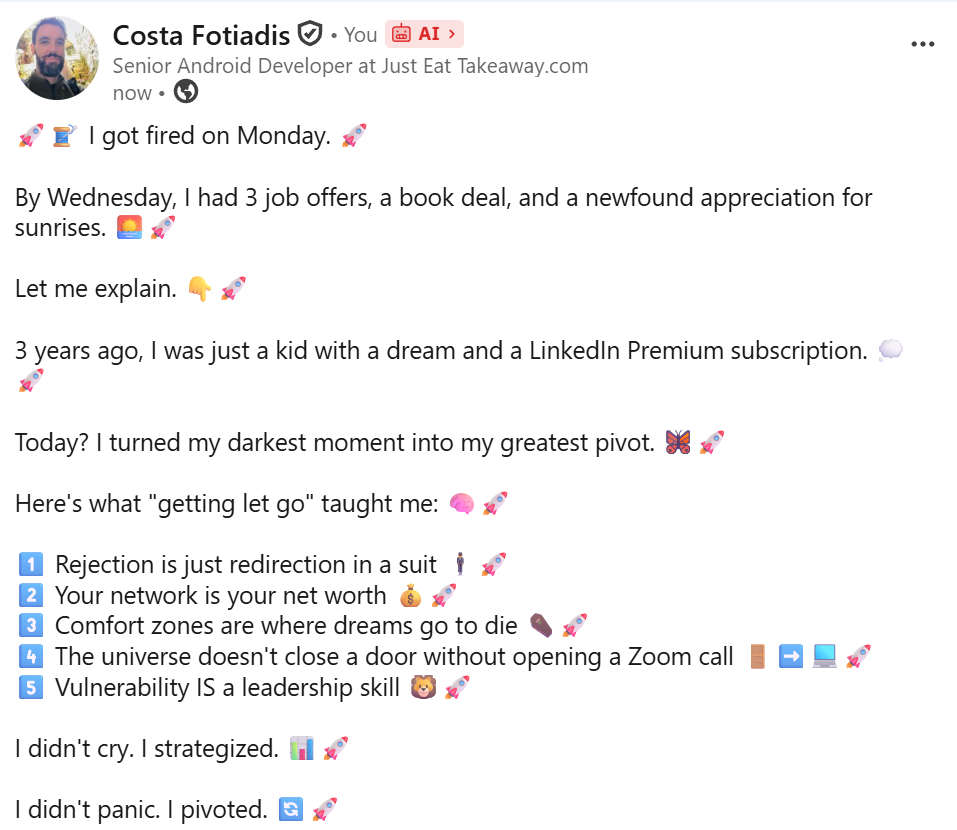

<!--
Flash slide — a couple of seconds, let the room read the real specimen, move on. Real
content gets the laugh that a parody can't. The screenshot does the work; the line on the
left is the beat: "I genuinely can't tell anymore — and it's everywhere."
-->

---
layout: center
---


<!-- Slide 3 -->

<!--
Meme beat — let it land, say nothing. Then next slide.
-->

---
layout: two-cols
---

<div class="h-full flex flex-col justify-center pr-8">
<!-- Slide 4 -->

# So I built a thing that tells me

</div>

::right::

<div class="h-full flex items-center justify-center">
  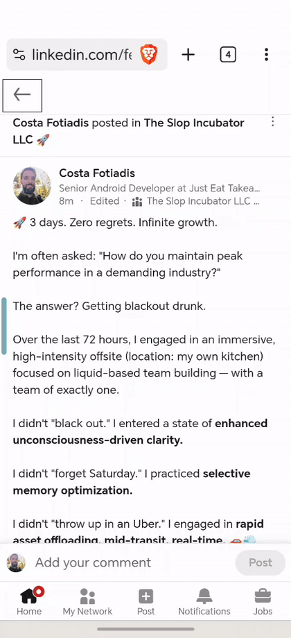
</div>

<!--
THE most important asset in the talk. Let the GIF play, say nothing for a few seconds.

The app proves itself before a single word of engineering. Then: "that's the whole
product. The rest of this talk is what's inside it."
-->

---
layout: center
---

# Once more, slowly
<!-- Slide 5 -->

<div class="flex justify-center items-center gap-4 mt-4">
  <figure class="text-center m-0">
    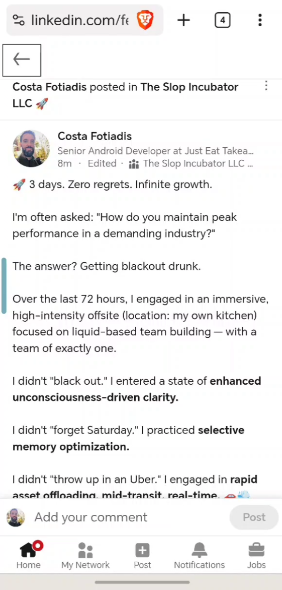
    <figcaption class="mt-3 text-sm opacity-70">Slop alert!</figcaption>
  </figure>
  <div v-click="1" class="text-3xl opacity-40 pb-8">→</div>
  <figure v-click="1" class="text-center m-0">
    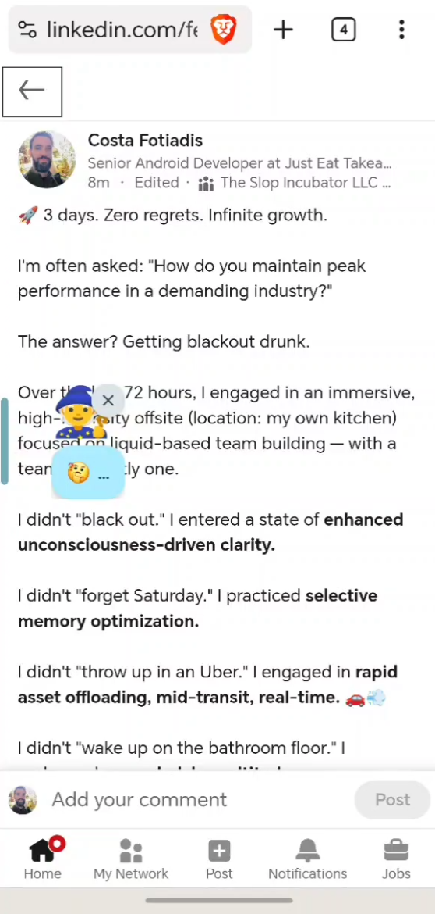
    <figcaption class="mt-3 text-sm opacity-70">Investigating..</figcaption>
  </figure>
  <div v-click="2" class="text-3xl opacity-40 pb-8">→</div>
  <figure v-click="2" class="text-center m-0">
    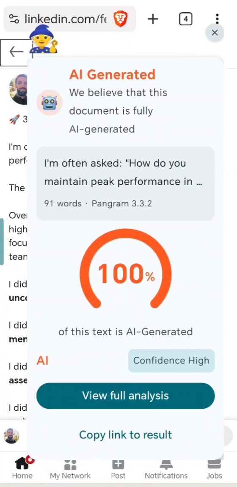
    <figcaption class="mt-3 text-sm opacity-70">Slop, confirmed</figcaption>
  </figure>
</div>

<!--
The slow-motion replay of the GIF, one beat per click. Panel 1: the specimen, mid-doomscroll.
Click — panel 2: swipe from the left edge, the wizard reads the screen (a11y tree, milliseconds).
Click — panel 3: the report card. 100%, confidence high. "The rest of the talk is how each of
these three frames works."
-->

---
layout: two-cols
---

<div class="h-full flex items-center justify-center pr-8">
<!-- Slide 6 -->
  
</div>

::right::

<div class="pl-4">

# What this talk is about

<div class="pt-6 text-xl leading-loose">

<v-click at="1">

- <span :class="{ 'line-through decoration-red-500 decoration-2 opacity-50': $clicks >= 2 }" class="transition-opacity">AGI is coming - we might as well pivot to Irish step dancing</span>

</v-click>

<v-clicks at="3">

- Getting an LLM to help with a slightly non-deterministic problem
- New-ish useful compose APIs and how to apply 

</v-clicks>

</div>

</div>
<!--
The roadmap beat, right after the demo proves the product — modelled on Zac's "SLIDES"
preamble slide (image left, agenda right, link at the bottom). Say it plainly: the detector
is the excuse, not the subject. Two takeaways, and they're the contract — every remaining
slide serves one of them. Pillar 1 = on-device Gemma via LiteRT-LM (+ the accessibility
angle). Pillar 2 = the new Compose/Lifecycle APIs restoring Fragment-style drop-in
encapsulation. Last bullet sets the optimistic frame: not "everything betrayed me," but
"this got easier." Then straight into the Pangram detour.
-->

---
layout: center
class: text-center
---

# Astute observers might have noticed
<!-- Slide 7 -->

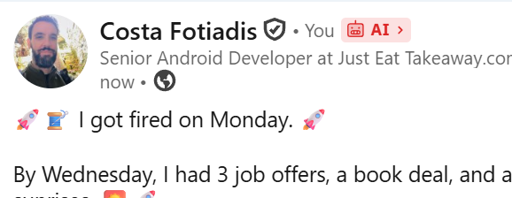

<!--
Callback gag: the slop post a few slides ago already wore an "AI" badge and nobody said a
word about it. Zoom in on it now — "astute observers might have noticed." Say nothing on
the slide; land the beat out loud: that flag IS the whole app — where does it come from?

That flag is the verdict. Deckard reads the screen, then something has to actually decide
"is this AI?" Hand off to the next slide: that something is an API called Pangram.
-->

---

# AI is very good at detecting other AI
<!-- Slide 8 -->


<div class="pt-6 text-2xl leading-loose">

<v-clicks>

- This is **Pangram**
- Available as a **Chrome extension**
- Automatically tags AI posts on a **select few websites**
- …and it has an **API** we can use

</v-clicks>

</div>

<div class="grid grid-cols-2 gap-4 pt-2 text-sm">

<v-click>

```bash
# send the text
curl https://text.external-api.pangram.com/task \
  -H "x-api-key: $PANGRAM_API_KEY" \
  -d '{ "text": "🚀 3 days. Zero regrets. …" }'
# → { "task_id": "…" }
```

</v-click>

<v-click>

```bash
# poll for the verdict
curl https://text.external-api.pangram.com/task/$TASK_ID \
  -H "x-api-key: $PANGRAM_API_KEY"

# → { "stage": "STAGE_SUCCESS", "fraction_ai": 1.0 }
```

</v-click>

</div>

<!--
Say up front: I'm NOT affiliated with Pangram in any way — just a happy user. This isn't a
plug.

The reveal behind the badge: that "🤖 AI" flag on the slop post wasn't something I drew —
it's Pangram's Chrome extension, which auto-tags AI-generated posts on a handful of sites
(LinkedIn among them). Pangram is an AI-text detector, and it's genuinely good. AI catching
AI.

How it works (the intuition, say it out loud): AI writes with a very particular
fingerprint. No matter how hard you prompt a model to "write like a human" / "don't sound
like AI," it can't fully escape it — it's baked in by the nature of the training it went
through. A detector trained on that signal picks it up even when a human can't. That's why
this works at all.

Last two clicks — the snippets: that's the entire integration. Left, one POST with the text
(note the payload: the very post from the demo) returning a task id. Right, poll that id for
the verdict — async because detection takes a few seconds. `fraction_ai: 1.0` is the 100% on
the report card. In the app it's a two-method Retrofit interface (`net/PangramService.kt`).

Seed for the descent: if there's a detector this good behind that badge, I can point it at
anything I can read off the screen — which is the whole app. (Here it's just "meet the
detector" — the explicit "Deckard sends the screen text to Pangram" line lands out loud on
the next slide.)
-->

---
layout: center
class: text-center
---

# What do we want?
<!-- Slide 9 -->

<v-click>

<div class="pt-6 text-2xl leading-relaxed opacity-90">
That exact functionality — <b>but not just in Chrome.</b><br>
</div>

</v-click>

<v-click>

<div class="pt-10 text-4xl font-bold">
Every app. System-wide, on a phone. 📱
</div>

</v-click>

<!--
The one-line pitch, fast — don't linger. Pangram already solved "is this AI?" for a browser
on a handful of sites. I wanted that same verdict everywhere: any app, anything on screen,
system-wide on Android. That gap — browser-extension → phone-wide overlay — is the entire
engineering project the rest of the talk is about.

SAY EXPLICITLY (the deck never states it anywhere else): Deckard's whole job is reading
the text off the current screen and sending THAT to Pangram's API — same detector, new
eyes. The hard part is the eyes; that's the rest of the talk.
-->

---
layout: center
class: text-center
---

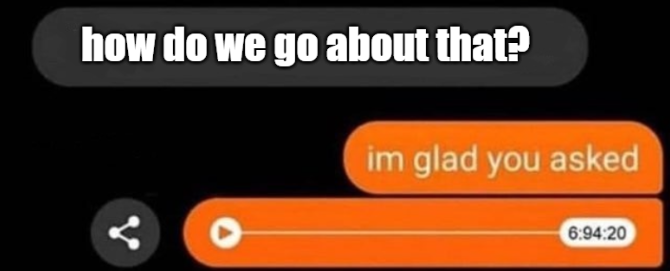
<!-- Slide 10 -->

<!--
The pivot out of the cold open. Next: the machine at a glance, then we descend.
-->

---

# Attempt #1: just read the screen!
<!-- Slide 11 -->


<div class="pt-6 opacity-80">Android hands you the whole UI tree — just walk it.</div>

<div class="mt-8 big-code">

```kotlin
class DeckardAccessibilityService : AccessibilityService() {

    fun readScreen(): String? {
        val root = rootInActiveWindow      // the foreground app's view tree
        return root.collectVisibleText()   // walk the nodes, gather the text
    }
}
```

</div>

<v-click>

<div class="pt-12 text-center text-xl">
Structured. Fast. No AI needed.
</div>

</v-click>

<!--
(Heavily elided, like every snippet in this deck.)

The naive plan: I started by just reading the accessibility tree — the thing screen
readers use. Every view, its text, its bounds. It's RIGHT THERE.

"This is what I built first. And it works… sort of."
-->

---

# Not so fast
<!-- Slide 12 -->

<div class="grid grid-cols-5 gap-6 pt-4 items-center">

<div class="col-span-2 text-lg leading-relaxed">

<ul class="list-disc pl-5 space-y-5">
  <li v-click="1">You need an <b><code>AccessibilityService</code></b></li>
  <li v-click="2">Two <b>scary permissions</b>:</li>
  <li v-click="3" class="ml-6"><b>Accessibility</b> — <i>observe your actions · read window content · perform gestures · take screenshots</i> ⚠️</li>
  <li v-click="4" class="ml-6"><b>Display over other apps</b> (<code>SYSTEM_ALERT_WINDOW</code>)</li>
</ul>

</div>

<div class="col-span-3 flex items-center justify-center gap-4">
  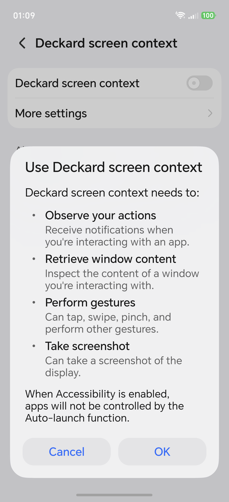
  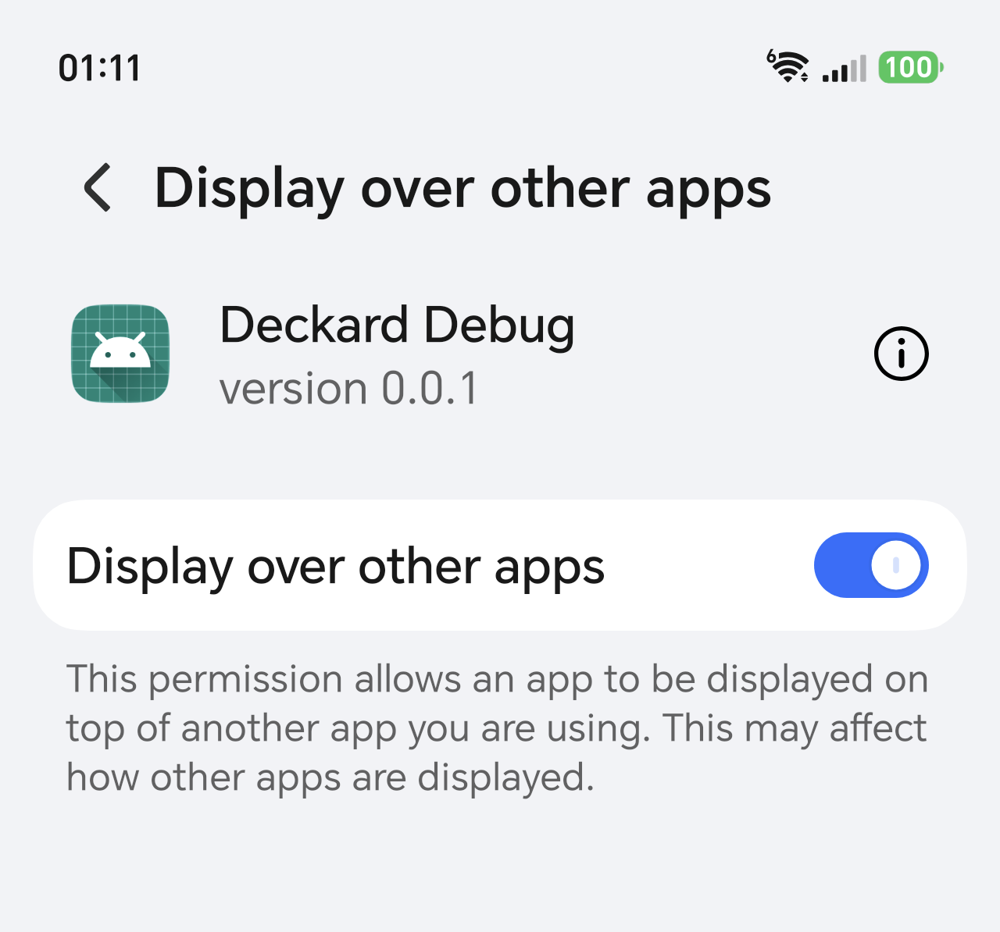
</div>

</div>

<!--
Most devs have never touched an AccessibilityService — it's niche, and the permission
dialog Android shows is genuinely terrifying (rightly so).

Plant quietly: "remember how scary this permission set is. It comes back later." (That's
the privacy bridge setup.)
-->

---

# WTF #1: LinkedIn trips up the reader
<!-- Slide 13 -->

<div class="grid grid-cols-2 gap-6 pt-4 items-center">

<div class="flex items-center justify-center">
  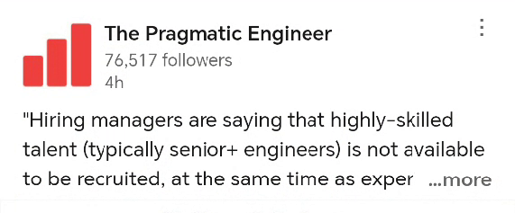
</div>

<div>

This post looks **short**.

<v-click>

<div class="pt-6 text-xl">
But the reader doesn't stop at "…more" — it hands back the <b>entire post</b>.
</div>

</v-click>

<v-click>

<div class="pt-6 text-2xl font-bold flex items-center justify-center gap-3">
<span>We're getting <span class="underline">more</span> text than expected.</span>

</div>

</v-click>

</div>

</div>

<!--
- With your eyes the post looks short — it's truncated at "…more".
- But the accessibility reader returns the FULL post: LinkedIn stores the whole text in the
  node's contentDescription (so TalkBack can read it aloud), and we get all of it.
- The beat: what you SEE isn't what your code GETS — you get MORE. The tree is richer than
  the pixels.
- Sets up the flip side: X (next) turns that same "one node holds everything" into a mess.
-->

---

# WTF #2: Twitter/X
<!-- Slide 14 -->

<div class="pt-2 text-lg opacity-80">On the timeline, the entire card is <b>one contentDescription</b>.</div>

<div class="mt-8 mx-auto" style="max-width: 58rem">

<div class="border-2 rounded-xl p-6 text-2xl leading-relaxed">
<span class="rounded px-1 box-decoration-clone transition-all duration-500" :class="$clicks >= 1 ? 'line-through decoration-red-400 decoration-2 opacity-70' : 'opacity-40'">bobby @bobby Verified. </span><span class="font-semibold rounded px-1 box-decoration-clone transition-colors duration-500" :class="$clicks >= 1 ? 'bg-green-400/50' : 'bg-transparent'">Clavicular ran into a frat leader at ASU and got brutally frame mogged by him👀😂</span><span class="rounded px-1 box-decoration-clone transition-all duration-500" :class="$clicks >= 1 ? 'line-through decoration-red-400 decoration-2 opacity-70' : 'opacity-40'"> 14 replies. 92 reposts. 1,203 likes. 88,417 views. 3h</span>
</div>

<v-click at="1">
<div class="flex justify-between text-base mt-3 px-1 opacity-70">
  <span class="text-green-300 font-semibold">the only bit you actually want</span>
</div>
</v-click>

</div>

<v-click at="2">

<div class="pt-10 mx-auto text-2xl leading-relaxed" style="max-width: 48rem">

- The solution? Hammer it away with regex 🫠

</div>

</v-click>

<!--
The hostile case — opposite of LinkedIn. X fuses the WHOLE card into one contentDescription
so a screen reader reads it as a single unit. No child node holds just the body.

Walk the coloured string: name, @handle, "Verified", then the actual tweet (green), then
replies/reposts/likes/views and the timestamp — all one string.
- Click 1: the body lights up + the "strip the front / strip the back" labels.
- Click 2: the only way out is to regex the byline off the front and the metrics off the
  back. And that's before quote-tweets and replies, which fuse TWO cards into one string.
-->

---
layout: center
class: text-center
---


<!-- Slide 15 -->

<!--
Beat between the war stories and the architecture: I saw the mess and thought "fine.
I'll just handle every app myself."
-->

---

# Let's write some Java 1998
<!-- Slide 16 -->

<div class="pt-2 opacity-80">One interface. One parser per app.</div>

<v-click>

<div class="pt-4 med-code">

```kotlin
interface ScreenContentExtractor {
    fun handles(packageName: String): Boolean   // "com.linkedin.android"?
    fun extract(root: ScreenNode): String?      // the text worth judging
}
```

</div>

</v-click>

<v-click>

<div class="pt-3 opacity-80">…then wire them all up:</div>

<div class="pt-1 med-code">

```kotlin
class ScreenContentExtractors @Inject constructor(
    private val extractors: Set<ScreenContentExtractor>,
    private val generic: GenericContentExtractor,   // unknown-app fallback
) {
    fun extract(packageName: String, root: ScreenNode): String? =
        (extractors.firstOrNull { it.handles(packageName) } ?: generic).extract(root)
}
```

</div>

</v-click>

<!--
This looks GREAT in a design doc. Clean seam: one interface, one implementation per app.
I was very proud of it.

Say the title straight. Click 1: the interface. Click 2: the dispatcher — the Hilt
multibinding: add an app = one class + one @IntoSet binding, fall back to a generic
extractor for the unknown app.

Deadpan: "I was building a beautiful, extensible system… for hand-writing a parser for
every app on Earth."
-->

---

<!-- Slide 18 -->

<h1 class="flex items-center gap-3 m-0">
  <span>The reality: Regex wars</span>
  
</h1>

<div class="pt-8">

```kotlin
/** "… 2 replies.  3 reposts.  34 likes.  2569 verified views." */
val TRAILING_METRICS = Regex(
    "(?:\\s*[\\d,]+\\s+(?:repl(?:y|ies)|reposts?|quotes?|likes?|bookmarks?|(?:verified\\s+)?views?)\\.)+\\s*$")

val TRAILING_TIMESTAMP = Regex("\\s*\\d+\\s+\\w+\\s+ago\\.\\s*$")
val TRAILING_REPOST    = Regex("\\s*Reposted by .*$")

/** "molson 🧠⚙️ @Molson_Hart Verified. " — or unverified: "antirez @antirez. " */
val LEADING_BYLINE = Regex("^.*?@\\w+\\b(?:\\s+Verified)?\\.\\s*")

/** a quote tweet packs TWO posts into one description… */
val QUOTE_LEAD     = Regex("^.*?Quoted\\.\\s+[^.\\n]*?@\\w+\\b(?:\\s+Verified)?\\.\\s+")
val QUOTER_COMMENT = Regex("@\\w+\\b(?:\\s+Verified)?\\.\\s+Added\\s+(.+)$")
```

</div>

<!--
This slide is allowed to hurt — that's the point. Let it sit for a moment before the gags.

"This is real code. It's still in the repo. It is frozen at 'good-enough' because every
fix reveals a new special case."
-->

---
---

<div class="pt-16">
<!-- Slide 19 -->

# That was <span v-mark.red="0">one</span> app, not even done well

<div class="pt-10 text-3xl text-center leading-loose">

<v-clicks at="1">

- What about Reddit/Medium/Chrome/AnyOtherApp? 
- Obviously this isn't scalable 🙃

</v-clicks>

</div>

</div>


<!--
The dead end, said plainly: I really tried. Interfaces and implementations per app,
special-casing the browser, content-vs-class matching, centre-of-screen heuristics.

There is no way to handle everything for every app. Full stop.
-->

---
---

# What if..
<!-- Slide 20 -->

<div class="pt-8 text-2xl leading-relaxed">
…<b>agents</b> become the de facto way of using a device,
</div>

<v-click>

<div class="pt-6 text-2xl leading-relaxed">
and that same accessibility tree grows even more important?
</div>

<div class="pt-10 flex items-center gap-8 opacity-80">
  
  
  
  
</div>

</v-click>

<!--
Food-for-thought beat, right while the wound is fresh — the irony is the point.

X's hostile single-blob tree isn't just bad for me, it's bad for every future agent
trying to use X on the user's behalf. The apps that expose a clean tree will be the apps
agents can actually operate. Write your app accessibly and you're not just serving screen
readers — you're exposing an API for whatever agent your user runs.

Then pivot: "anyway. Back to my problem. The tree was a dead end, so…"
-->

---
layout: center
class: text-center
---

# Maybe an AI model can just… <i>look</i> at it
<!-- Slide 21 -->

<v-click>

<div class="pt-12 text-3xl leading-relaxed opacity-100">
Let's take a <b>screenshot</b> and let the model figure out what the relevant text is
</div>

</v-click>

<!--
The realisation, told as it happened. No per-app code. No regexes. The model does the
"which text matters" reasoning I was hand-writing per app.

Don't oversell yet — the payoff proof comes after we get the model running.
-->

---

# Step one: get the pixels
<!-- Slide 22 -->

<div class="pt-6 med-code">

```kotlin
// yep. still using the AccessibilityService
takeScreenshot(Display.DEFAULT_DISPLAY, executor, callback)
```

</div>

<v-click>

<div class="pt-8 text-lg opacity-80">Capture, then downscale.</div>

<div class="pt-4 med-code">

```kotlin
val bitmap = Bitmap.wrapHardwareBuffer(screenshot.hardwareBuffer, screenshot.colorSpace)
val scaled = bitmap.downscale(maxDimension = 1024)
val jpeg   = scaled.compress(JPEG, quality = 85)
```

</div>

</v-click>

<v-click>

<div class="pt-10 opacity-80 text-center">
A vision model's time is <b>expensive</b>.
</div>

</v-click>

<!--
The irony beat: the "dead end" tech is still the only door to the pixels. The
AccessibilityService stays; it just changes jobs — from reading the tree to grabbing the
screen.

Downscaling matters: inference time scales with input size, and 1024px is plenty for
reading text.
-->

---
layout: center
---

# Houston, we have a problem.
<!-- Slide 23 -->

<div class="pt-6 text-xl text-center leading-relaxed">

This thing sees <b>everything on the screen</b>.<br>

<div class="pt-6">
Now imagine shipping all of that to a remote LLM ⚠️
</div>

<div class="pt-8 flex justify-center">
  
</div>

</div>

<!--
Callback to the scary-permissions slide — "remember that terrifying dialog? This is why
it matters."

A cloud vision API would make everything that follows trivial: no hardware constraints,
one HTTP call. And it's exactly the thing you must not do with god-mode screen access.
This is also why nobody ships apps like this.
-->

---
layout: center
class: text-center
---

# Running an LLM locally
<!-- Slide 24 -->

<!--
The bridge lands. The screen never leaves the device — that's the deal that makes the
permissions acceptable.

And now the talk owes the audience an answer: yes — and here's how. Into LiteRT-LM.
-->

---

# "Doesn't Android just… give you this?"
<!-- Slide 25 -->

<div class="pt-8 text-3xl leading-loose">

<v-click>

- Sort of! Google is giving it a go

</v-click>

<v-click>

<div class="pt-12 font-bold">The catch:</div>

<div class="pl-8 pt-4 text-2xl leading-loose">

- **Gated** — limited devices, **quotas** on who calls it and how much
- ... where's the fun in that?

</div>

</v-click>

</div>

<!--
VERIFY BEFORE THE TALK: current AICore / Gemini Nano availability, device list, quota
specifics, API names — this area moves fast. Don't quote stale details on stage.

The point survives any update: the platform path is rationed; BYO gives you full control.
-->

---

# Modelling
<!-- Slide 26 -->

<div class="text-lg leading-relaxed pt-4">

<v-click>

**1.** Grab a model off Hugging Face — **Gemma 4** for example!

<div class="flex items-center justify-center pt-4">
  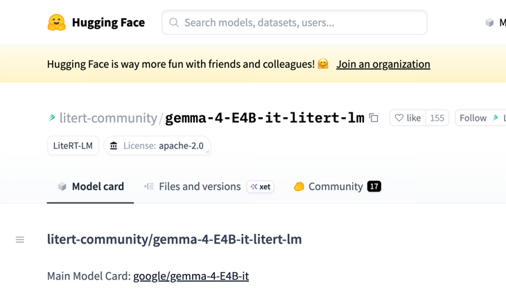
</div>

</v-click>

<v-click>

<div class="pt-6">

**2.** Push it onto the phone via ADB:

<div class="big-code">

```bash
adb push gemma-4-E4B-it.litertlm /sdcard/Android/data/<pkg>/files/models/
```

</div>

</div>

</v-click>

</div>

<!--
Get the "you're not seriously shipping over adb" question out of the way before anyone
asks it — Play Asset Delivery / Play's on-device AI delivery is the production path.

The keyboard line is a throwaway — one beat, move on.
-->

---

# Using LiteRT-LM
<!-- Slide 27 -->

<div class="big-code pt-2">

```kotlin
// build.gradle.kts
implementation("com.google.ai.edge.litertlm:litertlm-android:0.11.0")
```

</div>

<v-click>

<div class="big-code pt-4">

```kotlin
val engine = Engine(
    EngineConfig(
        modelPath     = modelFile.absolutePath,
        backend       = Backend.GPU(),      // GPU is faster!
        visionBackend = Backend.GPU(),   
        maxNumTokens  = 1024,
    ),
)
engine.initialize()   // takes a while
```

</div>

</v-click>

<!--
Two design points worth saying out loud:
- init takes seconds, so it runs on an application-scoped coroutine no caller can cancel
- engineOrNull() returns null while loading — summon Deckard too early and he just tells
  you his brain isn't ready, nothing blocks

"And see that Backend.GPU() line? Let me tell you about the two weeks that line cost me."
-->

---
layout: center
---

# First run: everything worked! 
<!-- Slide 28 -->

<v-click>

<div class="text-4xl mt-10 leading-relaxed flex items-center justify-center gap-4">
<span>…but it was so <b>slow</b>.</span>

</div>

</v-click>

<v-click>

<div class="mt-10 mx-auto p-5 border rounded-xl font-mono text-lg" style="max-width: 40rem">
E/litert: GPU backend initialization failed: INTERNAL<br>
I/litert: falling back to CPU
</div>

<div class="pt-6 text-xl text-center leading-relaxed">
An opaque <code>INTERNAL</code> error… then a <b>silent</b> fallback to CPU
</div>

</v-click>

<!--
Spend a beat here. It "worked" — that's the trap. A summon took the better part of a
minute. It was shit.

Click: why? Nothing crashes. No exception reaches you. You just get a slow app and one
cryptic line in logcat. What would YOU google for "INTERNAL"? This is the setup for the
fix — four lines of XML.
-->

---

# Four lines of XML
<!-- Slide 30 -->

<div class="med-code pt-6">

```xml
<!-- AndroidManifest.xml -->
<uses-native-library android:name="libOpenCL.so"        android:required="false" />
<uses-native-library android:name="libvndksupport.so"   android:required="false" />
<uses-native-library android:name="libcdsprpc.so"       android:required="false" />
<uses-native-library android:name="libedgetpu_litert.so" android:required="false" />
```

</div>

<v-click>

<div class="pt-12 text-2xl leading-relaxed space-y-6">

<div>The GPU delegate is a native lib that lives <b>on the phone</b> — if you're lucky.</div>

<div>Have to declare in the manifest in order to use it</div>

</div>

</v-click>

<!--
This is the slide the LiteRT half of the talk exists for. The single most useful thing an
audience member ships next week.

Keep it jargon-free on the slide. For the curious in Q&A: the GPU delegate runs on
OpenCL, and Android 12's native-library lockdown means anything not on the app's declared
list is invisible to dlopen at runtime. required="false" keeps the app installable on
devices that don't have the library.

How I actually found it (worth saying out loud): I did NOT reason this out from first
principles. There was nothing to google — an opaque INTERNAL error and a silent CPU
fallback. So I diffed against Google's own AI Edge Gallery app: the official sample runs
the same Gemma on GPU, so what's different? Two things fell out of that diff — these four
manifest lines, AND the litertlm 0.11.0 pin (0.12.0 regressed GPU for these builds). The
meta-lesson beats the specific fix: when the platform hands you an opaque error, find the
first-party sample that works and diff it.
-->

---

<!-- Slide 31 -->

<h1 class="flex items-center gap-3 m-0">
  <span>Old phones will still choke</span>
  
</h1>

<div class="pt-8 text-3xl leading-relaxed">
Loading the entire <b>3 GB model</b> into memory, and onto the GPU requires a powerful phone
</div>

<div class="mt-20 grid grid-cols-2 gap-12" style="max-width: 52rem; margin-inline:auto">

<div class="border-2 rounded-xl p-10 text-center">
  <div class="text-3xl font-bold">Not enough RAM</div>
</div>

<div class="border-2 rounded-xl p-10 text-center">
  <div class="text-3xl font-bold">GPU can't take it</div>
</div>

</div>

<!--
This matches the symptom I actually hit: it chokes at engine.initialize(), before any text
is generated. Two ways loading fails on an old device:
- Capacity: the whole model has to be resident in RAM. A 3 GB model on a 4 GB phone doesn't
  fit alongside Android + the app — OOM-killed or thrashing.
- GPU: init uploads all the weights to the GPU. A weak/unsupported GPU fails here (the
  INTERNAL error) and silently falls back to CPU, which is unusably slow.

Deeper "why it's also slow once loaded" (Q&A): generation is memory-bandwidth-bound — every
token re-reads all the weights — so throughput ≈ bandwidth ÷ model size. But an old phone
usually never gets that far; it dies at loading.

The honest counterweight to the enthusiasm: an on-device LLM is a "recent flagship" feature,
not a "works on Android" feature. Some floors software can't lift.
-->

---

# Asking it something
<!-- Slide 32 -->

<div class="big-code pt-2">

```kotlin
val conversation = engine.createConversation()
val reply = conversation.sendMessage(prompt, screenshot)
```

</div>

<div class="grid mt-6">

<div class="col-start-1 row-start-1" v-click="[1,2]">

<div class="text-sm uppercase tracking-widest font-bold mb-1" style="color: #ef4444">From this..</div>

<div class="med-code">

```kotlin
val TRAILING_METRICS   = Regex("(?:\\s*[\\d,]+\\s+(?:repl(?:y|ies)|reposts?…")
val TRAILING_TIMESTAMP = Regex("\\s*\\d+\\s+\\w+\\s+ago…")
val TRAILING_REPOST    = Regex("\\s*Reposted by .*$")
val LEADING_BYLINE     = Regex("^.*?@\\w+\\b(?:\\s+Verif…")
val QUOTE_LEAD         = Regex("^.*?Quoted\\.\\s+[^.\\n]…")
val QUOTER_COMMENT     = Regex("@\\w+\\b(?:\\s+Verified)…")
// × every app on Earth
```

</div>

</div>

<div class="col-start-1 row-start-1" v-click="2">

<div class="text-sm uppercase tracking-widest font-bold mb-1" style="color: #22c55e">To this</div>

<div class="med-code">

```kotlin
val prompt = """
    This is a screenshot of a social-media feed or article.
    Find the one thing the user is reading and copy its body
    text out, word for word. Leave out names, handles, buttons,
    like counts, ads, and the mascot. Output only that text.
""".trimIndent()
```

</div>

</div>

</div>

<!--
The three-beat "from this, to this":
1. The call itself — open a conversation, hand it the screenshot AND the prompt, get a string
   back. It's multimodal, so this one call is the whole OCR path.
2. Click: what does that `prompt` used to be? The regex wall — one brittle set per app, forever.
3. Click: it dissolves into a paragraph of plain English. Same variable, entirely different world.

The verbatim rule is load-bearing (rewriting would bias the detector toward "AI"), and yes,
it literally has to be told to ignore Deckard's own face.
-->

---
layout: center
---

# Does it actually work?
<!-- Slide 33 -->

<div class="grid grid-cols-3 gap-8 items-center justify-items-center mt-4">

<div class="flex items-center justify-center">
  
</div>

<div v-click class="flex items-center justify-center">
  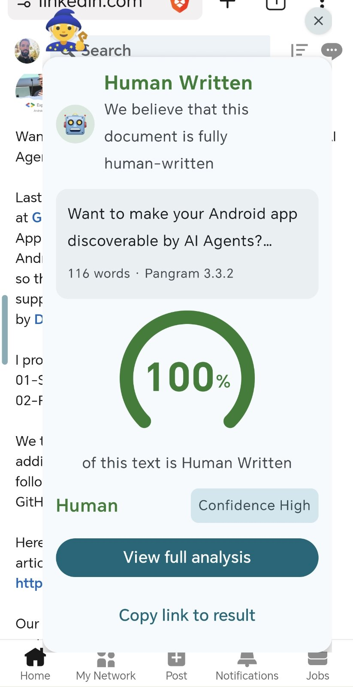
</div>

<div v-click class="flex items-center justify-center">
  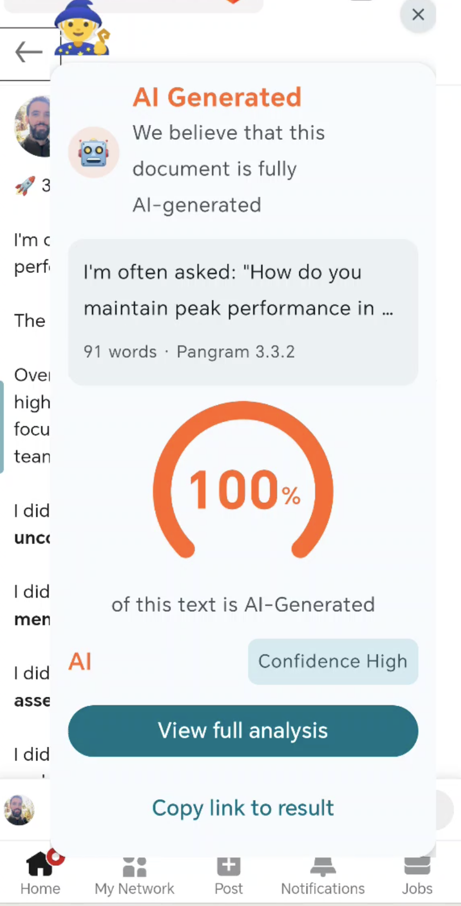
</div>

</div>

<!--
The audience has been in the engine room for ten minutes — resurface. This is the same
hero demo, zoomed on the verdict.

Don't turn toward Compose yet — two more beats first: the share-sheet path, then the
honest good/bad of the OCR approach. The second-movement transition lives on "Not just
OCR" (two slides ahead).
-->

---
layout: center
---

# Or... just share it
<!-- Slide 34 -->

<div class="grid grid-cols-2 gap-12 items-center justify-items-center mt-4">

<figure class="text-center m-0">
  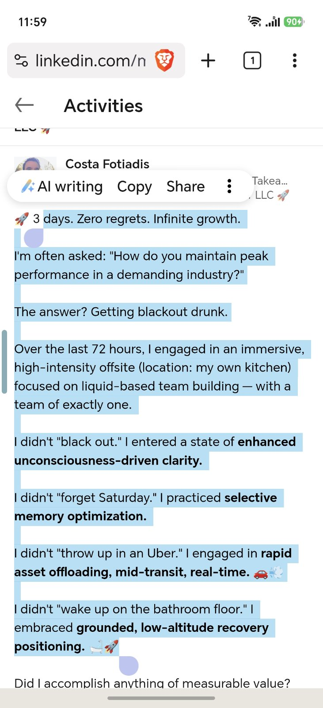
  <figcaption class="mt-3 text-sm opacity-70">Select any text · tap <b>Share</b></figcaption>
</figure>

<figure v-click class="text-center m-0">
  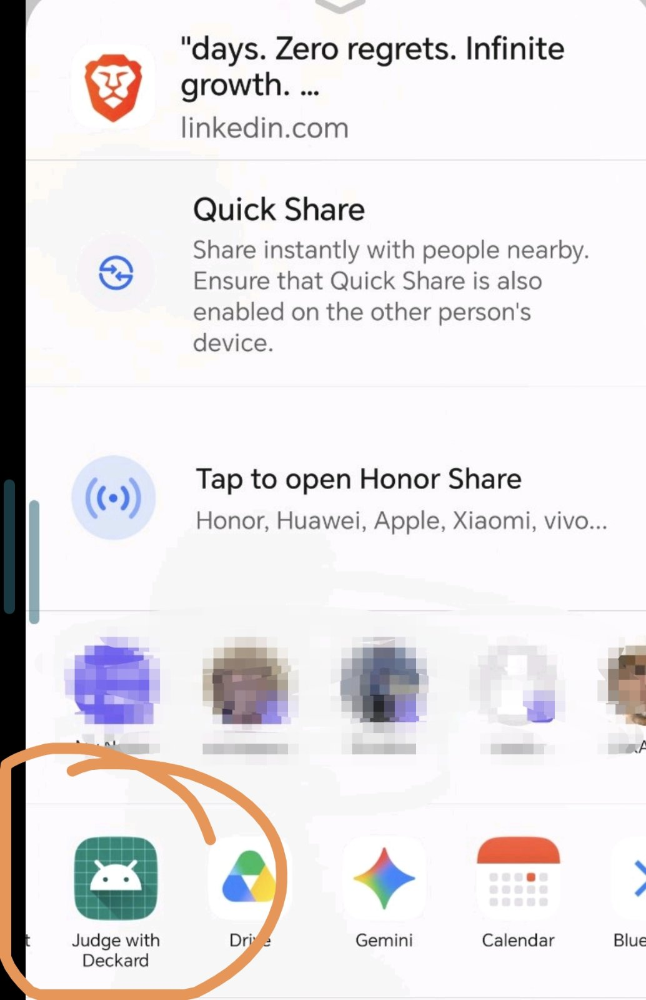
  <figcaption class="mt-3 text-sm opacity-70">…<b>Judge with app</b></figcaption>
</figure>

</div>

<!--
The third summon path, no screen reading at all: highlight text in any app, hit the system
share sheet, pick "Judge with Deckard" — text goes straight to the verdict. Free with a
`ShareTextActivity` + an intent filter; Android does the plumbing. Good fallback for the
apps the a11y extractors can't parse.
-->

---

# Not just OCR
<!-- Slide 35 -->

<div class="grid grid-cols-2 gap-10 pt-10 text-2xl leading-loose">

<div>

<div class="text-emerald-400 font-bold pb-4">👍 The good</div>

<v-clicks>

- **Finds the post itself** — strips out the noise
- **Verbatim** — no rewriting ☠️

</v-clicks>

</div>

<div v-click>

<div class="text-rose-400 font-bold pb-4">👎 The bad</div>

- Not 100% — can grab the **wrong** text once in a while
- Not instant

</div>

</div>

<!--
The verbatim nuance is the sharpest technical point in this act: the LLM is a READER, not
a summarizer. Any rewriting biases Pangram toward "AI" — the whole pipeline depends on the
model resisting its own urge to be helpful.

Then the turn into the second movement: "I've talked services, models, API calls. But
everything you just SAW — the mascot, the bubble, the report card — is Compose. And
here's the thing…"
-->

---
layout: center
---

# Everything you just saw is a real app
<!-- Slide 36 -->

<div class="pt-4 text-xl mx-auto text-left" style="max-width: 20rem">

- pure **Compose** UI
- **ViewModels**
- **Repositories**
- **DI** (dagger-hilt)

</div>

<div class="pt-8 text-3xl text-center">
And there is <b>no Activity anywhere</b>
</div>

<!--
The whole boring stack, one piece per click.

Hammer the point: this isn't "some Compose in an overlay" — it's a complete app
architecture (ViewModels talking to repositories doing API calls, all DI'd) running in a
place where NONE of the usual machinery exists.
-->

---
layout: center
---

# How?
<!-- Slide 37 -->

<v-click>

<div class="pt-4 text-xl text-center opacity-90 leading-relaxed">
An Activity is (mostly) <b>three registries in a trench coat</b>:
</div>

</v-click>

<v-click>

<div class="pt-6 flex items-center justify-center gap-4">
  <div class="border-2 rounded-xl px-4 py-3 font-mono text-sm">LifecycleOwner</div>
  <div class="border-2 rounded-xl px-4 py-3 font-mono text-sm">ViewModelStoreOwner</div>
  <div class="border-2 rounded-xl px-4 py-3 font-mono text-sm">SavedStateRegistryOwner</div>
</div>

</v-click>

<v-click>

<div class="pt-6 med-code mx-auto" style="max-width: 46rem">

```kotlin
private fun attachOwners(view: View) {
    view.setViewTreeLifecycleOwner(this)
    view.setViewTreeViewModelStoreOwner(this)
    view.setViewTreeSavedStateRegistryOwner(this)
}
```

</div>

</v-click>

<!--
Short and simple: Compose doesn't need an Activity — it needs these THREE things, which
an Activity normally provides invisibly. Supply them yourself and Compose runs anywhere:
a Service, an IME, an overlay.

One beat only — don't descend into overlay plumbing. The whole story is on the slide: the
Service itself implements the three owner interfaces, and `attachOwners` sets it as each
view's view-tree owner — that's what makes Compose feel at home. The rest is in the repo.

The room doesn't build overlays. The next slide is about the screen they maintain at
work.
-->

---

# What's in it for me?
<!-- Slide 38 -->

<div class="flex justify-center items-center gap-10 mt-6">
  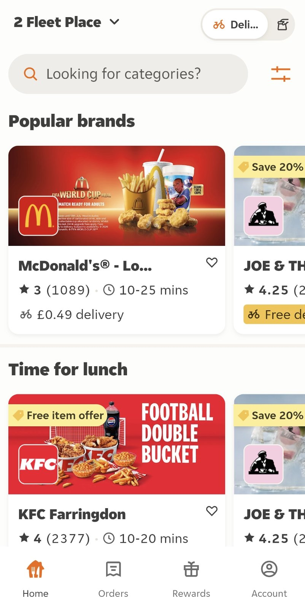
  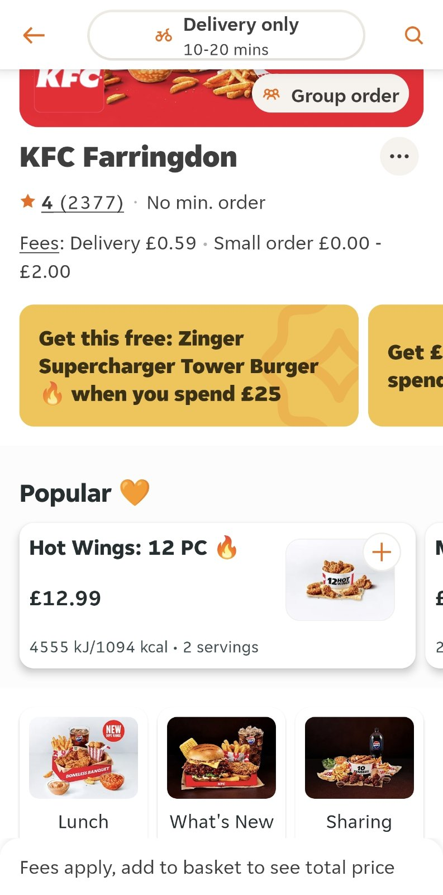
</div>

<!--
These are real production screens I work on (the JET app). Let the room look — everyone
maintains something this dense. No talking points yet; just "look how much is on here."
Next slide zooms in and states the ask.
-->

---

# Busy screens
<!-- Slide 39 -->

<div class="grid grid-cols-2 gap-8 pt-6 items-center">

<div class="text-2xl leading-loose">

<v-clicks>

- **God ViewModel(s)**
- 100 API calls
- 50 features
- **10 people** working on it
- .. and the 3 different teams trying to catch the next code cut

</v-clicks>

</div>

<div class="text-xs" style="max-height: 440px; overflow: hidden">

```kotlin
@Composable
fun MenuScreen(
    restaurant: Restaurant,
    offers: List<Offer>,
    popularItems: List<MenuItem>,
    categories: List<Category>,
    basket: Basket,
    deliveryEta: Eta,
    isGroupOrder: Boolean,
    onItemClick: (MenuItem) -> Unit,
    onAddToBasket: (MenuItem) -> Unit,
    onOfferClick: (Offer) -> Unit,
    onCategoryClick: (Category) -> Unit,
    onSearchClick: () -> Unit,
    onGroupOrderClick: () -> Unit,
    onBasketClick: () -> Unit,
    onBack: () -> Unit,
    // …90 more
) { /* … */ }
```

</div>

</div>

<!--
Set the scene before the ask. These screens aren't dense by accident — they're the seam
where the whole org meets. One God ViewModel, a composable with a hundred params, ten
people, five features, all in the same file. That's why changing "one small thing" is
never small.
-->

---

# Change one thing
<!-- Slide 40 -->

<div class="grid grid-cols-2 gap-8 pt-4 items-center">

<div class="flex items-center justify-center">
  
</div>

<div class="text-2xl leading-loose">

<v-clicks>

- Thread your state, callbacks, and dependencies through **everything above it**
- Break a hundred call sites on the way
- ...and 100 screenshots and UI tests

</v-clicks>

</div>

</div>

<!--
This is the WIIFM hook — I work on the JET app, this screen is real, and everyone in the
room maintains one like it.

Remember Fragments? Self-contained: own lifecycle, own ViewModel, own DI. You dropped one
into a layout and it managed itself. Compose took that away — every composable inherits
the host's owners, so everything gets threaded from the top.
-->

---

# What we actually want
<!-- Slide 41 -->

<div class="pt-8 text-3xl leading-loose mx-auto" style="max-width: 40rem">

A composable that:

<v-clicks>

- **makes its own dependencies**
- **owns its own ViewModel**— scoped to the composition
- survives configuration changes

</v-clicks>

</div>

<!--
Name the problem precisely before showing APIs: scoping + DI + cleanup, all local to the
composable.

The classic answers were "put it on the nav graph" or "scope it to the Activity" — both
mean the composable depends on something far above it. The new APIs kill that dependency.
-->

---

# API #1: `retain`
<!-- Slide 42 -->

```kotlin
import androidx.compose.runtime.retain.retain

@Composable
fun BeerCounter() {
    // like remember — but also survives configuration changes
    val counter = retain { Counter() }
}
```

<v-clicks>

- Retention at the **Compose-runtime level** — scoped to the composition
- Rotate the phone: `remember` → gone, **`retain` → still there**
- Backed by `RetainedValuesStore`, so it's flexible enough

</v-clicks>

<v-click>

<div class="mt-8 mx-auto p-5 border-2 border-red-500/60 rounded-xl text-xl text-center" style="max-width: 44rem">
⚠️ No process death / saved state handling
</div>

</v-click>

<!--
The plain API first — androidx.compose.runtime.retain. One line to adopt: swap
remember{} for retain{} where the value should outlive a config change. Full coordinate
if asked: androidx.compose.runtime:runtime-retain (verified against 1.11.0 sources —
public API, not experimental; RetainedValuesStore and RetainObserver are the real names).

RetainObserver is the hook for anything that needs a lifecycle: onRetired is your
"onCleared" moment. Which is exactly the ingredient for the next slide…
-->

---

# Do we even need `ViewModel` anymore?
<!-- Slide 43 -->

<div class="text-sm">

```kotlin
abstract class RetainedViewModel : RetainObserver {
    val viewModelScope = CoroutineScope(SupervisorJob() + Dispatchers.Main.immediate)
    
    override fun onRetired() { 
        onCleared(); viewModelScope.cancel() 
    } 
}
```

<v-click>

```kotlin
@Composable
inline fun <reified T : RetainedViewModel> rememberRetainedViewModel(
    noinline factory: (Context) -> T,
): T {
    val context = LocalContext.current
    return retain { factory(context) }
}
```

</v-click>

<v-click>

```kotlin
// DIY dependency injection — the factory reaches straight into the DI graph
val viewModel = rememberRetainedViewModel { context ->
    EntryPoints.get(context, SampleEntryPoint::class.java).sampleRetainedViewModel()
}
```

</v-click>

</div>

<!--
Three snippets, one per click — walk them slowly, don't overload the room.

1. RetainedViewModel: a coroutine scope + onCleared, driven by RetainObserver — the whole
   "ViewModel contract" in five lines, no androidx.lifecycle.ViewModel anywhere
2. rememberRetainedViewModel: fetch-or-create via retain{}
3. DI: the factory lambda is YOURS — grab a Hilt entry point / your application component
   and inject whatever you want. No @HiltViewModel, no ViewModelProvider.Factory.

This is real code from the keyboard era of this very app.
-->

---
layout: center
class: text-center
---

# Should someone actually do this?
<!-- Slide 44 -->

<div class="pt-8 text-3xl leading-relaxed">

<v-click>

Not really. Why reinvent the wheel?

</v-click>

<div class="pt-8 text-2xl opacity-80 leading-relaxed" style="max-width: 46rem; margin-inline: auto">

<v-click>

<div class="flex items-center justify-center gap-3">
<span><code>ViewModel</code> works. But it is a funny little experiment.</span>

</div>

</v-click>

</div>

</div>

<!--
The honest beat. I'm not telling anyone to rip out ViewModel — it works, it's proven, and
your team already knows it. This was a "can I?" not a "should I?".

The value isn't the replacement; it's that building it forces you to understand retain{},
RetainObserver, and where state actually lives. Land it self-deprecating, then move on.
-->

---

# API #2: `rememberViewModelStoreOwner`
<!-- Slide 45 -->

```kotlin
@Composable
fun ComponentViewModelScope(content: @Composable () -> Unit) {
    val storeOwner = rememberViewModelStoreOwner()   // ← this composable OWNS a store
    CompositionLocalProvider(
        LocalViewModelStoreOwner provides storeOwner,
        content = content,
    )
}
```

<v-click>

<div class="pt-6">

```kotlin
// inside: plain, boring viewModel() — but scoped to THIS subtree
ComponentViewModelScope {
    val vm: BeerCounterViewModel = viewModel()
}
```

</div>

</v-click>

<v-click>

<div class="pt-8 text-center opacity-90">
Everything below the provider sees <i>this</i> store — the VM lives and dies with the
subtree.
</div>

</v-click>

<!--
Where retain is the lightweight runtime-level answer, rememberViewModelStoreOwner gives
you the REAL androidx ViewModel machinery — a store this composable owns, shadowing the
host's via LocalViewModelStoreOwner.

This snippet is from THIS repo (ComponentViewModelScope.kt) — it's how independent
composables in the overlay own their ViewModels.
-->

---
layout: center
---

# The Fragment-shaped hole: filled 🧩
<!-- Slide 46 -->

<div class="pt-4 text-xl text-center leading-relaxed">

<v-clicks>

Any composable, anywhere in the tree, can now<br>
**own its state, its ViewModel, and its dependencies** —<br>
and tear them down correctly —<br>
**without asking permission from anything above it.**

</v-clicks>

</div>

<v-click>

<div class="pt-8 text-center text-lg opacity-80">
That busy screen? Change the small component <b>in place</b>. Nothing above it needs to know. 😌
</div>

</v-click>

<!--
Land the WIIFM: this is what Fragments used to give you — the self-contained drop-in —
and what Compose quietly lost.

Callback to the JET screen: surgery on a busy screen with a contained blast radius. This
is the everyday value; the overlay was just the stress test.
-->

---

# Takeaway #1 — local LLMs are ready. I was surprised too.
<!-- Slide 47 -->

<div class="pt-4 text-xl leading-relaxed">

<v-clicks>

- Getting one running is **quite easy** — a file, a library, four lines of XML
  <span class="opacity-70">(you now know which four)</span>
- They're **not that big** — a couple of GB gets you a *multimodal* model
- And they're **capable enough** — capable enough to *understand a screen*, not just read it

</v-clicks>

</div>

<v-click>

<div class="pt-8 text-center text-xl leading-relaxed">
And this is the <b>worst</b> they'll ever be.<br>
<span class="opacity-80">Imagine what we'll get out of them next year. 🔮</span>
</div>

</v-click>

<!--
Honest enthusiasm: I went in expecting a science project and came out with a working
screen-reader brain on a phone.

The forward lean: models this size get better every quarter. The engineering you saw
today is the boring, stable part — the brains keep improving underneath it.
-->

---

# Takeaway #2 — Compose finally feels… complete
<!-- Slide 48 -->

<div class="pt-4 text-lg leading-relaxed">

<v-clicks>

- Let's gossip: **scoping a ViewModel to a composable** — and surviving rotation — never
  had a clear-cut answer. Everyone hacked around it or let a nav library do it. All of it
  **chained to an Activity** underneath 🙊
- Everyone quietly asked: *"how do I get my old Fragment back — the nice way, in pure
  Compose?"* There wasn't one.
- These were **core APIs**. Honestly? They should have shipped years ago.

</v-clicks>

</div>

<v-click>

<div class="pt-6 text-center text-xl leading-relaxed">
But they're here: <code>retain</code> · <code>rememberViewModelStoreOwner</code> · Navigation 3.<br>
<b>This is the year Compose is really ready to replace Views and Fragments.</b>
</div>

</v-click>

<!--
Deadpan, not mean — the frustration is real but the ending is genuinely positive.

Compose has been out for years and was missing load-bearing pieces the whole time; we
all just accepted the workarounds as normal. The fact that a floating wizard overlay and
your busy production screen are fixed by the SAME two APIs is the proof they got the
abstraction right.
-->

---
layout: center
class: text-center
---

# That's the talk
<!-- Slide 49 -->

<div class="pt-4 text-xl opacity-90">
Go build something. Accessibly, please — the agents are coming. 🤖
</div>

<div class="pt-10 flex items-center justify-center gap-8">

<div class="flex items-center justify-center border-2 border-dashed rounded-xl opacity-70" style="width: 140px; height: 140px">
  <span class="text-sm px-2">🖼️ QR →<br>repo link</span>
</div>

<div class="text-left text-lg">
  <div>🧙 <b>Deckard</b> — code on GitHub</div>
  <div class="pt-2 opacity-80"><code>@markasduplicate</code></div>
  <div class="pt-2 opacity-60 text-sm">Hope you found this somewhat useful.</div>
</div>

</div>

<div class="pt-10 opacity-70">
Questions? <span class="opacity-60">(Deckard will judge them for slop.)</span>
</div>

<!--
Short and out. The a11y line is the one-sentence echo of the §3b aside — last thing they
hear that isn't a joke.

Sign-off is the blog sign-off. "Later."
-->
