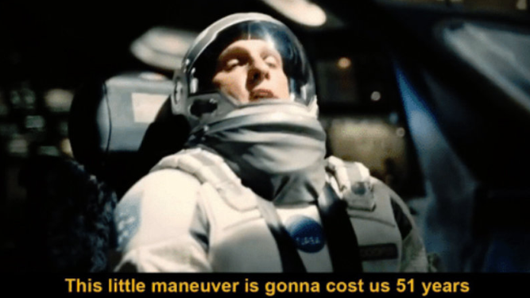

# Fighting AI slop with anti-slop

The on-device Android engineering behind a slop detector

<div class="pt-16 text-sm opacity-70">
Costa Fotiadis · <code>@markasduplicate</code>
</div>

<!--
Cold open, before advancing: no agenda up front, no "about me" slide. Straight into the
bit. (The roadmap waits until after the hero demo — slide 5 — so it lands as "here's what's
inside," not as ceremony.)
-->

---
layout: two-cols-header
---

# The internet is drowning in slop 🚀

::left::

<div class="pr-6 pt-6 text-lg leading-relaxed opacity-80">
Every feed. Every day. 🚀 "I'm humbled to announce…", the em-dashes, the engagement bait.
<br><br>
Did a person write this, or did they paste it out of ChatGPT? I genuinely can't tell anymore.
</div>

::right::


<!--
Flash slide — a couple of seconds, let the room read the real specimen, move on. Real
content gets the laugh that a parody can't. The screenshot does the work; the line on the
left is the beat: "I genuinely can't tell anymore — and it's everywhere."
-->

---
layout: center
---


<!--
Meme beat — let it land, say nothing. Then next slide.
-->

---
layout: center
---

# So I built a thing that tells me

<div class="mt-6 mx-auto flex items-center justify-center border-2 border-dashed rounded-xl opacity-70" style="width: 640px; height: 300px">
  <div class="text-center px-8">
    🎬 <b>PLACEHOLDER — hero demo GIF</b><br>
    <span class="text-sm">scrolling LinkedIn → maximum-slop post (🚀 "I'm humbled to announce…")
    → summon Deckard → verdict: <i>"This is slop, son."</i></span>
  </div>
</div>

<!--
THE most important asset in the talk. Let the GIF play, say nothing for a few seconds.

The app proves itself before a single word of engineering. Then: "that's the whole
product. The rest of this talk is what's inside it."
-->

---
layout: center
class: text-center
---

# Astute observers might have noticed


<!--
Callback gag: the slop post a few slides ago already wore an "AI" badge and nobody said a
word about it. Zoom in on it now — "astute observers might have noticed." Say nothing on
the slide; land the beat out loud: that flag IS the whole app — where does it come from?

That flag is the verdict. Deckard reads the screen, then something has to actually decide
"is this AI?" Hand off to the next slide: that something is an API called Pangram.
-->

---

# AI is very good at detecting other AI

<div class="pt-10 text-2xl leading-loose">

<v-clicks>

- This is **Pangram**
- Available as a **Chrome extension**
- Automatically tags AI posts on a **select few websites**
- …and it has an **API** we can use

</v-clicks>

</div>

<!--
Say up front: I'm NOT affiliated with Pangram in any way — just a happy user. This isn't a
plug.

The reveal behind the badge: that "🤖 AI" flag on the slop post wasn't something I drew —
it's Pangram's Chrome extension, which auto-tags AI-generated posts on a handful of sites
(LinkedIn among them). Pangram is an AI-text detector, and it's genuinely good. AI catching
AI.

How it works (the intuition, say it out loud): AI writes with a very particular
fingerprint. No matter how hard you prompt a model to "write like a human" / "don't sound
like AI," it can't fully escape it — it's baked in by the nature of the training it went
through. A detector trained on that signal picks it up even when a human can't. That's why
this works at all.

Seed for the descent: if there's a detector this good behind that badge, I can point it at
anything I can read off the screen — which is the whole app. (That Deckard calls Pangram's
API is spelled out on the machine-at-a-glance slide; here it's just "meet the detector.")
-->

---
layout: center
class: text-center
---

# What do I want?

<v-click>

<div class="pt-6 text-2xl leading-relaxed opacity-90">
That exact functionality — <b>but not just in Chrome.</b><br>
</div>

</v-click>

<v-click>

<div class="pt-10 text-4xl font-bold">
Every app. System-wide, on my phone. 📱
</div>

</v-click>

<!--
The one-line pitch, fast — don't linger. Pangram already solved "is this AI?" for a browser
on a handful of sites. I wanted that same verdict everywhere: any app, anything on screen,
system-wide on Android. That gap — browser-extension → phone-wide overlay — is the entire
engineering project the rest of the talk is about.
-->

---
layout: center
class: text-center
---


<!--
The pivot out of the cold open. Next: the machine at a glance, then we descend.
-->

---

# At a glance

<div class="grid grid-cols-5 items-center gap-2 pt-10">

<v-click>
<div class="col-span-1 border-2 rounded-xl p-4 text-center">
  <div class="text-4xl">🧙</div>
  <div class="font-bold pt-2">The face</div>
  <div class="text-sm opacity-70 pt-1">A system-wide overlay</div>
</div>
</v-click>

<div class="text-center text-3xl opacity-50">→</div>

<v-click>
<div class="col-span-1 border-2 rounded-xl p-4 text-center">
  <div class="text-4xl">👀</div>
  <div class="font-bold pt-2">The eyes</div>
  <div class="text-sm opacity-70 pt-1">To read the screen</div>
</div>
</v-click>

<div class="text-center text-3xl opacity-50">→</div>

<v-click>
<div class="col-span-1 border-2 rounded-xl p-4 text-center">
  <div class="text-4xl">⚖️</div>
  <div class="font-bold pt-2">The judge</div>
  <div class="text-sm opacity-70 pt-1">An API call</div>
</div>
</v-click>

</div>

<!--
"Let's look at this thing at a glance — then we go into detail."

One beat only — this is the map for the descent, not a lecture. Three pieces:
- the face: the floating mascot, a system overlay, no Activity anywhere (that lands later)
- the eyes: reading the screen — the whole middle of the talk
- the brain: the slop verdict is literally an API call. Won't even bother under ~50 words.
(Say the brain/50-words bit out loud if it fits — nothing more on the slide.)

Then descend: "so let's talk about the eyes. How hard can reading a screen be?"
-->

---

# Another easy weekend project

<v-click>



</v-click>

<!--
The classic: "I'll build this in a weekend." Narrator: he did not build it in a weekend.
Say the title straight, then click the meme in for the punchline.
-->

---

# Attempt #1: just read the screen!

<div class="pt-6 opacity-80">Accessibility service hands you the whole UI tree — just walk it.</div>

<div class="mt-8">

```kotlin
class DeckardAccessibilityService : AccessibilityService() {

    fun readScreen(): String? {
        val root = rootInActiveWindow      // the foreground app's view tree
        return root.collectVisibleText()   // walk the nodes, gather the text
    }
}
```

</div>

<v-click>

<div class="pt-12 text-center text-xl">
Structured. Fast. No AI needed.
</div>

</v-click>

<!--
(Heavily elided, like every snippet in this deck.)

The naive plan: I started by just reading the accessibility tree — the thing screen
readers use. Every view, its text, its bounds. It's RIGHT THERE.

"This is what I built first. And it works… sort of."
-->

---

# Small print: it's harder than it seems

<div class="grid grid-cols-2 gap-8 pt-4">

<div>

<v-clicks>

- You need an **`AccessibilityService`** — be honest, have *you* ever written one?
- You need the **scariest permissions on the platform**:
  - accessibility — <i>"full control of your device"</i> ⚠️
  - `SYSTEM_ALERT_WINDOW` — draw over every app
  - screenshots — also via the accessibility service
- And the **user** has to be walked through granting all of it

</v-clicks>

</div>

<div class="flex items-center justify-center border-2 border-dashed rounded-xl opacity-70" style="height: 280px">
  <div class="text-center px-6">
    🖼️ <b>PLACEHOLDER</b><br>
    <span class="text-sm">screenshot of Android's scary
    "Allow Deckard full control of your device?" accessibility dialog</span>
  </div>
</div>

</div>

<!--
Most devs have never touched an AccessibilityService — it's niche, and the permission
dialog Android shows is genuinely terrifying (rightly so).

Plant quietly: "remember how scary this permission set is. It comes back later." (That's
the privacy bridge setup.)
-->

---

# War story #1: LinkedIn lies to you

<div class="grid grid-cols-2 gap-6 pt-4 items-center">

<div class="flex items-center justify-center border-2 border-dashed rounded-xl opacity-70" style="height: 300px">
  <div class="text-center px-6">
    🖼️ <b>PLACEHOLDER</b><br>
    <span class="text-sm">screenshot of a collapsed LinkedIn post —
    the visible text ends in <b>"…more"</b></span>
  </div>
</div>

<div>

The post you can *see* ends in **"…more"**.

<v-click>

<div class="pt-2">

The **full** post hides in `contentDescription`:

```kotlin
// read the fuller of the two
fun ScreenNode.bestText() =
    if (description.length > text.length)
        description else text
```

</div>

</v-click>

</div>

</div>

<!--
First contact with reality: the tree is only as good as the app developer made it — and
you don't control LinkedIn.

You're writing LinkedIn-specific logic just to FIND the post body. Foreshadowing: this is
already one bespoke parser.
-->

---

# War story #2: X declares war

<div class="pt-2 opacity-80">On the timeline, a tweet exposes <b>no per-element text at all</b> — the entire card is <b>one string</b>.</div>

<div class="mt-4 flex items-center justify-center border-2 border-dashed rounded-xl opacity-70" style="height: 290px">
  <div class="text-center px-8">
    🖼️ <b>PLACEHOLDER</b><br>
    <span class="text-sm">annotated captures of what the a11y tree hands you for a
    <b>normal tweet</b>, a <b>quote tweet</b> and a <b>reply</b> — name, handle, body,
    timestamp and counts fused into one <code>contentDescription</code> blob per card.
    A mess.</span>
  </div>
</div>

<v-click>

<div class="pt-6 text-center text-xl">
To get the tweet out… you parse it back apart. With regexes. 🫠
</div>

</v-click>

<!--
The hostile case. X concatenates the whole card into a single contentDescription so a
screen reader reads it as one unit. There is no child TextView holding just the body.

The only way to get the tweet body is to strip the byline off the front and the
metrics/timestamp off the back of one giant string.
-->

---

<div class="mx-auto flex items-center justify-center border-2 border-dashed rounded-xl opacity-70" style="width: 480px; height: 320px">
  <div class="text-center px-6">
    🖼️ <b>PLACEHOLDER — "challenge accepted" meme</b><br>
    <span class="text-sm">the moment before writing a parser per app seemed like a
    good idea</span>
  </div>
</div>

<!--
Beat between the war stories and the architecture: I saw the mess and thought "fine.
I'll just handle every app myself."
-->

---

# But first, the "scalable architecture" 😎

<div class="pt-2 opacity-80">One interface per app. Dispatch on the foreground package. What could go wrong?</div>

```kotlin
interface ScreenContentExtractor {
    fun handles(packageName: String): Boolean   // "com.linkedin.android"?
    fun extract(root: ScreenNode): String?      // the text worth judging
}
```

```kotlin
class ScreenContentExtractors @Inject constructor(
    private val extractors: Set<ScreenContentExtractor>,
    private val generic: GenericContentExtractor,   // unknown-app fallback
) {
    fun extract(packageName: String, root: ScreenNode): String? =
        (extractors.firstOrNull { it.handles(packageName) } ?: generic).extract(root)
}
```

<!--
This looks GREAT in a design doc. Clean seam, Hilt multibinding, add an app = one class +
one binding. I was very proud of it.

Deadpan: "I was building a beautiful, extensible system… for hand-writing a parser for
every app on Earth."
-->

---

# The reality: one extractor's worth of "handling X"

```kotlin
/** "… 2 replies.  3 reposts.  34 likes.  2569 verified views." */
val TRAILING_METRICS = Regex(
    "(?:\\s*[\\d,]+\\s+(?:repl(?:y|ies)|reposts?|quotes?|likes?|bookmarks?|(?:verified\\s+)?views?)\\.)+\\s*$")

val TRAILING_TIMESTAMP = Regex("\\s*\\d+\\s+\\w+\\s+ago\\.\\s*$")
val TRAILING_REPOST    = Regex("\\s*Reposted by .*$")

/** "molson 🧠⚙️ @Molson_Hart Verified. " — or unverified: "antirez @antirez. " */
val LEADING_BYLINE = Regex("^.*?@\\w+\\b(?:\\s+Verified)?\\.\\s*")

/** a quote tweet packs TWO posts into one description… */
val QUOTE_LEAD     = Regex("^.*?Quoted\\.\\s+[^.\\n]*?@\\w+\\b(?:\\s+Verified)?\\.\\s+")
val QUOTER_COMMENT = Regex("@\\w+\\b(?:\\s+Verified)?\\.\\s+Added\\s+(.+)$")
```

<v-clicks>

- Quote tweets pack **two posts into one string** — we judge the text after the word *"Added"*
- `"Promoted."` cards are skipped — Deckard refuses to judge ads
- A display name containing a `"."` defeats the byline parser — **one guy named "Dr. Smith" breaks everything**

</v-clicks>

<!--
This slide is allowed to hurt — that's the point. Let it sit for a moment before the gags.

"This is real code. It's still in the repo. It is frozen at 'good-enough' because every
fix reveals a new special case."
-->

---
layout: center
---

# That was <span v-mark.red="1">one</span> app

<div class="pt-6 text-xl text-center leading-relaxed">

<v-clicks at="2">

- LinkedIn ✅ <span class="opacity-60">(mostly)</span>
- X ✅ <span class="opacity-60">(frozen at "good-enough")</span>
- Reddit? The browser? <b>Every app you've never seen?</b>

</v-clicks>

</div>

<v-click>

<div class="pt-8 text-center text-2xl">
A per-app parser isn't a roadmap. It's a <b>treadmill</b>. 🏃‍♂️
</div>

</v-click>

<v-click>

<div class="mt-6 mx-auto flex items-center justify-center border-2 border-dashed rounded-xl opacity-70" style="width: 280px; height: 160px">
  <span class="text-sm px-4 text-center">🖼️ PLACEHOLDER — "sweating guy" meme</span>
</div>

</v-click>

<!--
The dead end, said plainly: I really tried. Interfaces and implementations per app,
special-casing the browser, content-vs-class matching, centre-of-screen heuristics.

There is no way to handle everything for every app. Full stop.
-->

---

# Aside: that tree is about to matter *more*

<div class="pt-4 text-xl leading-relaxed mx-auto" style="max-width: 36rem">

The accessibility tree failed <i>me</i>…

<v-click>

…but in an **agent future**, that tree is how assistants will **drive your app**.

</v-click>

<v-click>

Write your app accessibly and you're not just serving screen readers —
you're exposing an **API for whatever agent your user runs**.

</v-click>

</div>

<v-click>

<div class="pt-8 text-center text-xl opacity-90">
Accessibility is becoming your app's API. Maybe treat it like one. 🤷‍♂️
</div>

</v-click>

<!--
30-second aside, right while the wound is fresh — the irony is the point.

X's hostile single-blob tree isn't just bad for me, it's bad for every future agent
trying to use X on the user's behalf. The apps that expose a clean tree will be the apps
agents can actually operate.

Then pivot: "anyway. Back to my problem. The tree was a dead end, so…"
-->

---
layout: center
class: text-center
---

# Wait. Maybe the model can just… <i>look</i> at it? 🤔

<v-click>

<div class="pt-6 text-xl opacity-90">
These vision models are getting good.<br>
Take a <b>screenshot</b> — let the model figure out what the relevant text is. <i>Itself.</i>
</div>

</v-click>

<v-click>

<div class="pt-8 text-2xl">
screenshot → model → the post
</div>

<div class="pt-4 opacity-70">
One idea. Replaces the entire treadmill.
</div>

</v-click>

<!--
The realisation, told as it happened. No per-app code. No regexes. The model does the
"which text matters" reasoning I was hand-writing per app.

Don't oversell yet — the payoff proof comes after we get the model running.
-->

---

# Step one: get the pixels

<div class="pt-2 opacity-80">Small irony: guess which class is the <b>only</b> one allowed to take a screenshot…</div>

```kotlin
// yep. still the AccessibilityService. you never escape it. 🙃
takeScreenshot(Display.DEFAULT_DISPLAY, executor, callback)
```

<v-click>

```kotlin
// hardware buffer → bitmap → shrink → JPEG (the model doesn't need your 4K screen)
val bitmap = Bitmap.wrapHardwareBuffer(screenshot.hardwareBuffer, screenshot.colorSpace)
val scaled = bitmap.downscale(maxDimension = 1024)
val jpeg   = scaled.compress(JPEG, quality = 85)
```

</v-click>

<v-click>

<div class="pt-4 opacity-80 text-center">
Feed the model a shrunken JPEG, not a raw screen — a vision model's time is <b>expensive</b>.
</div>

</v-click>

<!--
The irony beat: the "dead end" tech is still the only door to the pixels. The
AccessibilityService stays; it just changes jobs — from reading the tree to grabbing the
screen.

Downscaling matters: inference time scales with input size, and 1024px is plenty for
reading text.
-->

---
layout: center
---

# One problem.

<div class="pt-6 text-xl text-center leading-relaxed">

<v-click>

This thing sees <b>everything on your screen</b>.<br>
<span class="opacity-80">Your bank. Your chats. Your email. Your questionable 2am searches.</span>

</v-click>

<v-click>

<div class="pt-6">
Now imagine shipping all of that, screen by screen,<br>
to a remote LLM <b>owned by somebody else</b>. ☁️
</div>

</v-click>

<v-click>

<div class="pt-8 text-3xl">
No. 🙅
</div>

<div class="pt-3 opacity-70">
No user would accept that. No user <i>should</i> accept that.
</div>

</v-click>

</div>

<!--
Callback to the scary-permissions slide — "remember that terrifying dialog? This is why
it matters."

A cloud vision API would make everything that follows trivial: no hardware constraints,
one HTTP call. And it's exactly the thing you must not do with god-mode screen access.
This is also why nobody ships apps like this.
-->

---
layout: center
class: text-center
---

# So the brain has to live <b>on the phone</b>

<v-click>

<div class="pt-8 text-2xl opacity-90">
Which raises a question…<br>
<span class="text-3xl"><b>can you even run an LLM on a phone?</b></span>
</div>

</v-click>

<!--
The bridge lands. The screen never leaves the device — that's the deal that makes the
permissions acceptable.

And now the talk owes the audience an answer: yes — and here's how. Into LiteRT-LM.
-->

---

# "Doesn't Android just… give you this?"

<div class="pt-4 text-lg leading-relaxed">

<v-clicks>

- Sort of! Google is turning Android into an intelligent system — **Gemini Nano** and
  on-device models, exposed to any app, **for free**
- The catch: **gated**. Limited devices, and **quotas** on who calls it and how much
  <span class="opacity-70">(your battery says thanks)</span>
- Fine for *a feature*. Not for an app whose whole job is **hammering a vision model**

</v-clicks>

</div>

<v-click>

<div class="pt-8 text-center text-2xl">
So: bring your own model. 💪
</div>

</v-click>

<!--
VERIFY BEFORE THE TALK: current AICore / Gemini Nano availability, device list, quota
specifics, API names — this area moves fast. Don't quote stale details on stage.

The point survives any update: the platform path is rationed; BYO gives you full control.
-->

---

# Bring your own brain 🧠

<div class="pt-2 text-lg leading-relaxed">

- A multimodal **Gemma**, one `.litertlm` file, **~3 GB**
  <span class="opacity-70">— but any model works; the loading story is the same</span>

</div>

<v-click>

```bash
# the caveman delivery pipeline 🧌
adb push gemma-3n.litertlm /sdcard/Android/data/<pkg>/files/models/
```

</v-click>

<v-click>

<div class="pt-4 opacity-80">
Real apps do this properly: the user downloads the model at runtime via <b>Play delivery</b>.
We're hacking around with adb, and I'm not sorry.
</div>

</v-click>

<v-click>

<div class="pt-4 text-sm opacity-60">
(The engine class still lives in a package called <code>suggestion/llm/</code> — this app used to be a
<i>keyboard</i>. The LLM is the sole survivor of the pivot.)
</div>

</v-click>

<!--
Get the "you're not seriously shipping over adb" question out of the way before anyone
asks it — Play Asset Delivery / Play's on-device AI delivery is the production path.

The keyboard line is a throwaway — one beat, move on.
-->

---

# The engine: LiteRT-LM

```kotlin
val engine = Engine(
    EngineConfig(
        modelPath     = modelFile.absolutePath,
        backend       = Backend.GPU(),      // ← the whole war is over this line
        visionBackend = Backend.GPU(),      // multimodal: images go to the GPU too
        maxNumTokens  = 1024,
    ),
)
engine.initialize()   // takes SECONDS — warm up early, off the main thread
```

<v-click>

```kotlin
fun engineOrNull(): Engine?   // non-blocking: null while loading, never freezes the UI
```

</v-click>

<v-click>

<div class="pt-4 opacity-80 text-center">
Warm up once per process on an app-scoped coroutine; callers degrade gracefully until the
brain is online.
</div>

</v-click>

<!--
Two design points worth saying out loud:
- init takes seconds, so it runs on an application-scoped coroutine no caller can cancel
- engineOrNull() returns null while loading — summon Deckard too early and he just tells
  you his brain isn't ready, nothing blocks

"And see that Backend.GPU() line? Let me tell you about the two weeks that line cost me."
-->

---
layout: center
---

# First run: it worked! 🎉

<v-click>

<div class="pt-4 text-2xl text-center">
…at roughly <b>one token per geological era</b>. 🐌
</div>

</v-click>

<v-click>

<div class="grid grid-cols-2 gap-6 mt-8 items-center text-left">

<div>

<div class="p-4 border rounded-xl font-mono text-sm">
E/litert: GPU backend initialization failed: INTERNAL<br>
I/litert: falling back to CPU
</div>

<div class="pt-4 opacity-80">
An opaque <code>INTERNAL</code> error… then a <b>silent</b> fallback to CPU —
<b>~10× slower</b>. Basically unusable.
</div>

</div>

<div class="flex items-center justify-center border-2 border-dashed rounded-xl opacity-70" style="height: 240px">
  <div class="text-center px-6">
    🎬 <b>PLACEHOLDER</b><br>
    <span class="text-sm">screen recording of the CPU run — Deckard thinking…
    and thinking… one word at a time</span>
  </div>
</div>

</div>

</v-click>

<!--
The war story, spend time here. The model loaded, generated text, everything "worked" —
except a summon took the better part of a minute. It was shit.

Nothing crashes. No exception reaches you. You just get a slow app and one cryptic line
in logcat. What would YOU google for "INTERNAL"?
-->

---

# The hardest bug in the project: four lines of XML

```xml
<!-- AndroidManifest.xml -->
<uses-native-library android:name="libOpenCL.so"        android:required="false" />
<uses-native-library android:name="libvndksupport.so"   android:required="false" />
<uses-native-library android:name="libcdsprpc.so"       android:required="false" />
<uses-native-library android:name="libedgetpu_litert.so" android:required="false" />
```

<v-click>

<div class="pt-4 text-lg leading-relaxed">

**In plain words:** the GPU "driver" is a native library that ships **with the phone**,
not with your app. Since Android 12, an app can only load native libraries it has
**declared in its manifest**. Didn't declare → can't load → no GPU → CPU.

</div>

</v-click>

<v-click>

<div class="pt-4 text-center text-xl">
Four lines. Two weeks. 🫠
</div>

</v-click>

<!--
This is the slide the LiteRT half of the talk exists for. The single most useful thing an
audience member ships next week.

Keep it jargon-free on the slide. For the curious in Q&A: the GPU delegate runs on
OpenCL, and Android 12's native-library lockdown means anything not on the app's declared
list is invisible to dlopen at runtime. required="false" keeps the app installable on
devices that don't have the library.
-->

---

# The honest cost: there's a hardware floor

<div class="pt-2 opacity-80">Same symptom — everything lands on the CPU. <b>Two</b> very different causes:</div>

<div class="grid grid-cols-2 gap-6 pt-6">

<v-click>
<div class="border-2 rounded-xl p-5">
  <div class="text-xl font-bold">Your fault 🔧</div>
  <div class="pt-2 opacity-80">Missing <code>&lt;uses-native-library&gt;</code> lines.</div>
  <div class="pt-2 text-green-500 font-bold">Fixable — four lines of XML.</div>
</div>
</v-click>

<v-click>
<div class="border-2 rounded-xl p-5">
  <div class="text-xl font-bold">The phone's fault 📱</div>
  <div class="pt-2 opacity-80">A ~2-year-old device: no usable GPU delegate. Falls to CPU with a <i>perfect</i> manifest.</div>
  <div class="pt-2 text-red-500 font-bold">Not fixable. A 3 GB model on CPU is a paperweight.</div>
</div>
</v-click>

</div>

<v-click>

<div class="pt-8 text-center text-xl leading-relaxed">
The a11y tree was fragile across <b>apps</b>. The model is fragile across <b>devices</b>.<br>
<span class="text-2xl">I traded app-fragility for device-fragility — and for this problem, that's the right trade.</span>
</div>

</v-click>

<!--
Be honest here — it's the counterweight to all the enthusiasm: an on-device LLM is a
"works on a recent flagship" feature, not a "works on Android" feature.

The synthesis line is the intellectual summary of the entire middle of the talk. Land it
slowly.
-->

---

# The code that replaced the regex wall

<div class="grid grid-cols-2 gap-4 pt-2">

<div class="opacity-40 text-xs">

```kotlin
val TRAILING_METRICS = Regex(
  "(?:\\s*[\\d,]+\\s+(?:repl(?:y|ies)|reposts?|…")
val TRAILING_TIMESTAMP = Regex("\\s*\\d+\\s+\\w+\\s+ago…")
val TRAILING_REPOST    = Regex("\\s*Reposted by .*$")
val LEADING_BYLINE     = Regex("^.*?@\\w+\\b(?:\\s+Verif…")
val QUOTE_LEAD         = Regex("^.*?Quoted\\.\\s+[^.\\n]…")
val QUOTER_COMMENT     = Regex("@\\w+\\b(?:\\s+Verified)…")
// × every app on Earth
```

</div>

<v-click>

<div class="border-2 rounded-xl p-4 text-sm leading-relaxed">

*"Exactly **one** main piece of writing is what the user is reading — find it and copy out
its body text, **word for word**.*

*Do not summarize, paraphrase, shorten, correct, or translate.*

*Leave everything else out: names, @handles, timestamps, buttons, like counts, ads,
'Suggested for you', the keyboard…"*

</div>

</v-click>

</div>

<v-click>

<div class="pt-6 text-center text-xl">
It's not Kotlin. It's <b>a paragraph of English</b>. And it works on apps I've never seen. 🤯
</div>

</v-click>

<!--
The hero slide of the whole LLM act. Left: the treadmill (greyed out, already suffered
through). Right: the entire replacement.

One prompt. Zero per-app code. The model does the "which text matters" reasoning — it
UNDERSTANDS the screen layout; it doesn't just transcribe pixels.
-->

---

# It *understands* the screen — it doesn't just OCR it

<div class="pt-2 text-lg leading-relaxed">

<v-clicks>

- The model **picks the post out of the noise itself** — layout comprehension, not
  transcription. <span class="opacity-70">This is *recent* — you couldn't trust a local model with this a year ago.</span>
- **The verbatim rule is load-bearing:** if the model rewrites the text even slightly, it
  hands the detector *AI-written* text — and poisons the verdict ☠️
- The prompt literally tells it to **ignore the floating mascot** — Deckard must be
  instructed not to judge his own face 🧙
- And there's a `clean()` function because the model *insists* on wrapping answers in
  quotation marks. Peak LLM-era engineering.

</v-clicks>

</div>

<div class="mt-4 flex items-center justify-center border-2 border-dashed rounded-xl opacity-70" style="height: 120px">
  <div class="text-center px-6">
    🎬 <b>PLACEHOLDER</b> — long-press demo: the model isolates the post on an app
    with <b>no extractor written for it</b>
  </div>
</div>

<!--
The verbatim nuance is the sharpest technical point in this act: the LLM is a READER, not
a summarizer. Any rewriting biases Pangram toward "AI" — the whole pipeline depends on the
model resisting its own urge to be helpful.

The demo GIF should be an app never handled in the a11y era — that's the proof.
-->

---
layout: center
---

# Remember what we were building?

<div class="mt-6 mx-auto flex items-center justify-center border-2 border-dashed rounded-xl opacity-70" style="width: 560px; height: 260px">
  <div class="text-center px-8">
    🎬 <b>PLACEHOLDER — the demo again, zoomed in</b><br>
    <span class="text-sm">mascot + report card, close up. "Hey look — this works!"</span>
  </div>
</div>

<v-click>

<div class="pt-6 text-center opacity-80">
(There's even a third door: <b>share</b> any text from any app straight to Deckard —<br>
share sheet → verdict. No screen reading involved at all.)
</div>

</v-click>

<!--
The audience has been in the engine room for ten minutes — resurface. This is the same
hero demo, zoomed on the verdict.

Then the turn into the second movement: "I've talked services, models, API calls. But
everything you just SAW — the mascot, the bubble, the report card — is Compose. And
here's the thing…"
-->

---
layout: center
---

# Everything you just saw is a real app

<div class="pt-4 text-xl mx-auto text-left" style="max-width: 20rem">

<v-clicks>

- pure **Compose** UI
- **ViewModels**
- **repositories**, API calls
- **DI** everywhere

</v-clicks>

</div>

<v-click>

<div class="pt-8 text-3xl text-center">
And there is <b>no Activity anywhere</b>. 😳
</div>

</v-click>

<!--
The whole boring stack, one piece per click.

Hammer the point: this isn't "some Compose in an overlay" — it's a complete app
architecture (ViewModels talking to repositories doing API calls, all DI'd) running in a
place where NONE of the usual machinery exists.
-->

---
layout: center
---

# How did I even go about this?

<v-click>

<div class="pt-4 text-xl text-center opacity-90 leading-relaxed">
Turns out an Activity is just <b>three registries in a trench coat</b>: 🥸
</div>

</v-click>

<v-click>

<div class="pt-6 flex items-center justify-center gap-4">
  <div class="border-2 rounded-xl px-4 py-3 font-mono text-sm">LifecycleOwner</div>
  <div class="border-2 rounded-xl px-4 py-3 font-mono text-sm">ViewModelStoreOwner</div>
  <div class="border-2 rounded-xl px-4 py-3 font-mono text-sm">SavedStateRegistryOwner</div>
</div>

<div class="pt-6 text-xl text-center">
Hand Compose those three, and it runs <b>anywhere</b>. So I became them.
</div>

</v-click>

<v-click>

<div class="pt-8 text-xl text-center">
But that's <i>my</i> weird problem. Here's the part that's <b>yours</b>…
</div>

</v-click>

<!--
Short and simple: Compose doesn't need an Activity — it needs these THREE things, which
an Activity normally provides invisibly. Supply them yourself and Compose runs anywhere:
a Service, an IME, an overlay.

One beat only — do NOT descend into overlay plumbing. The Service implements the three
owner interfaces and sets them as view-tree owners; that's the whole story, and it's in
the repo for anyone curious.

The room doesn't build overlays. The next slide is about the screen they maintain at
work.
-->

---

# Your problem: the very busy screen

<div class="grid grid-cols-2 gap-8 pt-4">

<div class="flex items-center justify-center border-2 border-dashed rounded-xl opacity-70" style="height: 300px">
  <div class="text-center px-6">
    🖼️ <b>PLACEHOLDER</b><br>
    <span class="text-sm">a genuinely busy production screen —
    Just Eat Takeaway home screen</span>
  </div>
</div>

<div class="text-lg leading-relaxed">

<v-clicks>

- You're asked to change **one small component** in there
- In Compose that means: the **hundred-parameter composable** 😰
- Thread your state, callbacks, and dependencies through **everything above it**…
- …and break a hundred call sites on the way

</v-clicks>

</div>

</div>

<v-click>

<div class="pt-6 text-center text-xl">
A composable is <b>really hard to make independent</b> on a busy screen.
</div>

</v-click>

<!--
This is the WIIFM hook — I work on the JET app, this screen is real, and everyone in the
room maintains one like it.

Remember Fragments? Self-contained: own lifecycle, own ViewModel, own DI. You dropped one
into a layout and it managed itself. Compose took that away — every composable inherits
the host's owners, so everything gets threaded from the top.
-->

---

# What we actually want

<div class="pt-4 text-xl leading-relaxed mx-auto" style="max-width: 36rem">

A composable that:

<v-clicks>

- **makes its own dependencies** 🏗️
- **owns its own ViewModel** — scoped *exactly to the composition*
- survives **recomposition and rotation**
- and **cleans up after itself** when it leaves 🧹

</v-clicks>

</div>

<v-click>

<div class="pt-8 text-center opacity-80 text-lg">
Scoping a ViewModel used to be the <i>navigation library's</i> job — or an Activity's.<br>
<b>Not anymore.</b> Two (new-ish) APIs:
</div>

</v-click>

<!--
Name the problem precisely before showing APIs: scoping + DI + cleanup, all local to the
composable.

The classic answers were "put it on the nav graph" or "scope it to the Activity" — both
mean the composable depends on something far above it. The new APIs kill that dependency.
-->

---

# API #1: `retain` — like `remember`, but tougher

```kotlin
@Composable
fun BeerCounter() {
    // like remember { } — but it ALSO survives configuration changes 💪
    val counter = retain { Counter() }
}
```

<v-clicks>

- Retention at the **Compose-runtime level** — scoped to the composition, not to an
  Activity's `ViewModelStore`
- Rotate the phone: `remember` → gone, **`retain` → still there**
- Zero plumbing: no owners, no factories, no nav graph — works **anywhere a composition
  exists**
- Wants cleanup? Implement `RetainObserver` — you get `onRetained` / `onRetired` callbacks

</v-clicks>

<!--
The plain API first — androidx.compose.runtime.retain. One line to adopt: swap
remember{} for retain{} where the value should outlive a config change.

RetainObserver is the hook for anything that needs a lifecycle: onRetired is your
"onCleared" moment. Which is exactly the ingredient for the next slide…
-->

---

# You don't even need a `ViewModel` anymore 🧪

<div class="text-sm">

```kotlin
// 1. a "ViewModel": just a scope + cleanup, driven by RetainObserver
abstract class RetainedViewModel : RetainObserver {
    val viewModelScope = CoroutineScope(SupervisorJob() + Dispatchers.Main.immediate)
    override fun onRetired() { onCleared(); viewModelScope.cancel() }   // 🧹
}
```

<v-click>

```kotlin
// 2. a one-liner to fetch-or-create it — scoped to the composition
@Composable
inline fun <reified T : RetainedViewModel> rememberRetainedViewModel(
    noinline factory: (Context) -> T,
): T {
    val context = LocalContext.current
    return retain { factory(context) }
}
```

</v-click>

<v-click>

```kotlin
// 3. DIY dependency injection — the factory reaches straight into the DI graph
val viewModel = rememberRetainedViewModel { context ->
    EntryPoints.get(context, SampleEntryPoint::class.java).sampleRetainedViewModel()
}
```

</v-click>

</div>

<v-click>

<div class="pt-2 text-center opacity-90">
Scope ✅ cleanup ✅ DI ✅ — no androidx <code>ViewModel</code>, no owners, no factories. <b>The sky's the limit.</b> 💸
</div>

</v-click>

<!--
Three snippets, one per click — walk them slowly, don't overload the room.

1. RetainedViewModel: a coroutine scope + onCleared, driven by RetainObserver — the whole
   "ViewModel contract" in five lines, no androidx.lifecycle.ViewModel anywhere
2. rememberRetainedViewModel: fetch-or-create via retain{}
3. DI: the factory lambda is YOURS — grab a Hilt entry point / your application component
   and inject whatever you want. No @HiltViewModel, no ViewModelProvider.Factory.

This is real code from the keyboard era of this very app.
-->

---

# API #2: `rememberViewModelStoreOwner` — real ViewModels, locally scoped

```kotlin
@Composable
fun ComponentViewModelScope(key: Any, content: @Composable () -> Unit) {
    saveableStateHolder.SaveableStateProvider(key) {
        val storeOwner = rememberViewModelStoreOwner()   // ← this composable OWNS a store
        CompositionLocalProvider(
            LocalViewModelStoreOwner provides storeOwner,
            content = content,
        )
    }
}
```

<v-click>

```kotlin
// inside: plain, boring viewModel() — but scoped to THIS subtree, not the Activity
ComponentViewModelScope(key = "beer-counter") {
    val vm: BeerCounterViewModel = viewModel(factory = factory)
}
```

</v-click>

<v-click>

<div class="pt-3 text-center opacity-90">
Everything below the provider sees <i>this</i> store — the VM lives and dies with the
subtree. <b>No navigation library required.</b>
</div>

</v-click>

<!--
Where retain is the lightweight runtime-level answer, rememberViewModelStoreOwner gives
you the REAL androidx ViewModel machinery — a store this composable owns, shadowing the
host's via LocalViewModelStoreOwner.

This snippet is from THIS repo (ComponentViewModelScope.kt) — it's how independent
composables in the overlay own their ViewModels.
-->

---

# Bonus: Navigation 3 — nav that isn't chained to an Activity

```kotlin
val backStack = rememberNavBackStack(ScreenA)     // a plain list. YOU own it.
NavDisplay(
    backStack = backStack,
    onBack = { backStack.removeLastOrNull() },
    entryDecorators = listOf(
        rememberSaveableStateHolderNavEntryDecorator(),
        rememberViewModelStoreNavEntryDecorator(),  // ← per-screen VMs, cleared on pop
    ),
    entryProvider = entryProvider {
        entry<ScreenA> { ScreenA(viewModel(factory = factory)) }
        entry<ScreenB> { /* … */ }
    },
)
```

<v-clicks>

- **Pure Compose** — not tied to an Activity, not tied to *anything*. Great for **KMP** too
- I ran this — back stack, per-screen ViewModels, the lot — **inside the overlay. No
  Activity.** And it just worked 🤯

</v-clicks>

<div class="mt-3 flex items-center justify-center border-2 border-dashed rounded-xl opacity-70" style="height: 90px">
  <div class="text-center text-sm px-6">
    🎬 <b>PLACEHOLDER</b> — GIF: Nav3 panel navigating inside the overlay, no Activity anywhere
  </div>
</div>

<!--
⚠️ CUTTABLE SLIDE — Costa decides in the trim pass.

Navigation 3: the back stack is literally a mutableStateList you own; NavDisplay renders
it; decorators bolt on saveable state + per-entry ViewModel scoping (cleared on pop —
ViewModel.onCleared fires when the screen is popped).

Proving ground: I ran the full thing inside the WindowManager overlay — screens, back
navigation, per-screen DI'd ViewModels, retained across recomposition, cleared on pop.
Write-up lives in the repo (notes/nav3-viewmodels-in-a-service-overlay.md).
-->

---
layout: center
---

# The Fragment-shaped hole: filled 🧩

<div class="pt-4 text-xl text-center leading-relaxed">

<v-clicks>

Any composable, anywhere in the tree, can now<br>
**own its state, its ViewModel, and its dependencies** —<br>
and tear them down correctly —<br>
**without asking permission from anything above it.**

</v-clicks>

</div>

<v-click>

<div class="pt-8 text-center text-lg opacity-80">
That busy screen? Change the small component <b>in place</b>. Nothing above it needs to know. 😌
</div>

</v-click>

<!--
Land the WIIFM: this is what Fragments used to give you — the self-contained drop-in —
and what Compose quietly lost.

Callback to the JET screen: surgery on a busy screen with a contained blast radius. This
is the everyday value; the overlay was just the stress test.
-->

---

# Takeaway #1 — local LLMs are ready. I was surprised too.

<div class="pt-4 text-xl leading-relaxed">

<v-clicks>

- Getting one running is **quite easy** — a file, a library, four lines of XML
  <span class="opacity-70">(you now know which four)</span>
- They're **not that big** — a couple of GB gets you a *multimodal* model
- And they're **capable enough** — capable enough to *understand a screen*, not just read it

</v-clicks>

</div>

<v-click>

<div class="pt-8 text-center text-xl leading-relaxed">
And this is the <b>worst</b> they'll ever be.<br>
<span class="opacity-80">Imagine what we'll get out of them next year. 🔮</span>
</div>

</v-click>

<!--
Honest enthusiasm: I went in expecting a science project and came out with a working
screen-reader brain on a phone.

The forward lean: models this size get better every quarter. The engineering you saw
today is the boring, stable part — the brains keep improving underneath it.
-->

---

# Takeaway #2 — Compose finally feels… complete

<div class="pt-4 text-lg leading-relaxed">

<v-clicks>

- Let's gossip: **scoping a ViewModel to a composable** — and surviving rotation — never
  had a clear-cut answer. Everyone hacked around it or let a nav library do it. All of it
  **chained to an Activity** underneath 🙊
- Everyone quietly asked: *"how do I get my old Fragment back — the nice way, in pure
  Compose?"* There wasn't one.
- These were **core APIs**. Honestly? They should have shipped years ago.

</v-clicks>

</div>

<v-click>

<div class="pt-6 text-center text-xl leading-relaxed">
But they're here: <code>retain</code> · <code>rememberViewModelStoreOwner</code> · Navigation 3.<br>
<b>This is the year Compose is really ready to replace Views and Fragments.</b>
</div>

</v-click>

<!--
Deadpan, not mean — the frustration is real but the ending is genuinely positive.

Compose has been out for years and was missing load-bearing pieces the whole time; we
all just accepted the workarounds as normal. The fact that a floating wizard overlay and
your busy production screen are fixed by the SAME two APIs is the proof they got the
abstraction right.
-->

---
layout: center
class: text-center
---

# That's the talk

<div class="pt-4 text-xl opacity-90">
Go build something. Accessibly, please — the agents are coming. 🤖
</div>

<div class="pt-10 flex items-center justify-center gap-8">

<div class="flex items-center justify-center border-2 border-dashed rounded-xl opacity-70" style="width: 140px; height: 140px">
  <span class="text-sm px-2">🖼️ QR →<br>repo link</span>
</div>

<div class="text-left text-lg">
  <div>🧙 <b>Deckard</b> — code on GitHub</div>
  <div class="pt-2 opacity-80"><code>@markasduplicate</code></div>
  <div class="pt-2 opacity-60 text-sm">Hope you found this somewhat useful.</div>
</div>

</div>

<div class="pt-10 opacity-70">
Questions? <span class="opacity-60">(Deckard will judge them for slop.)</span>
</div>

<!--
Short and out. The a11y line is the one-sentence echo of the §3b aside — last thing they
hear that isn't a joke.

Sign-off is the blog sign-off. "Later."
-->
